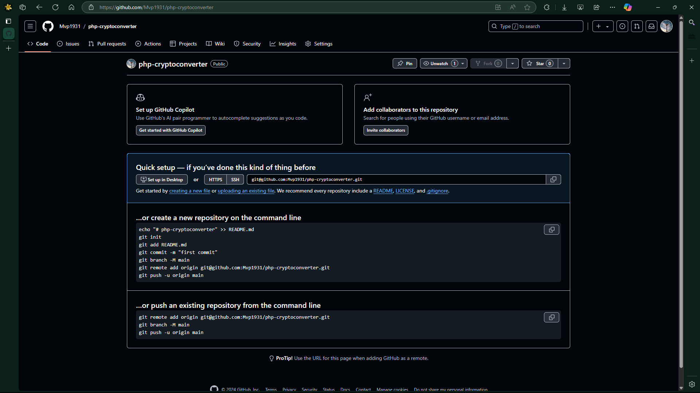
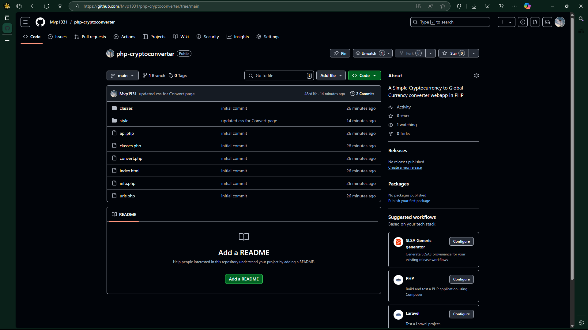
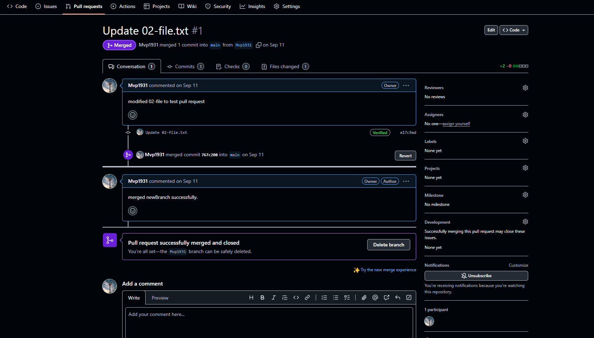

> [Go Home](../iac-labs.md)

# Objective: Understand basic version control concepts and operations using Git and GitHub.

## Assignments:

### Basic Git Commands:

-   Initialize a Git repository and commit changes.

### **Branching and Merging**:

-   Create a branch, make changes, and merge it into the main branch.

### **Collaboration with GitHub**:

-   Create a GitHub repository and push a local project to the repository.
-   Fork a public repository, make changes, and submit a pull request.

---

### Git Commands:

To start using Git, you need to install Git on your system.
You can download Git from the official website: https://git-scm.com/downloads

Once you have installed Git, you can verify the installation by running the following command in your terminal:

```powershell
git --version
```

This command will display the version of Git that you have installed.

```powershell
pwsh $ git --version
git version 2.47.0.windows.2
```

now, let's initialize a Git repository in your local directory:

```powershell
pwsh $ git init
```

this command will create a new Git repository in your current directory.

```powershell
pwsh $ pwd

Path
----
D:\ALL PROGRAMS\DefaultIdeaProjects\php-project\php-fundamentals\cryptomasters

pwsh $ git init
Initialized empty Git repository in D:/ALL PROGRAMS/DefaultIdeaProjects/php-project/php-fundamentals/cryptomasters/.git/
```

check the status of your repository:

```powershell
pwsh $ git status
On branch main

No commits yet

Untracked files:
  (use "git add <file>..." to include in what will be committed)
        api.php
        classes.php
        classes/
        convert.php
        index.html
        info.php
        style/
        urls.php

nothing added to commit but untracked files present (use "git add" to track)
```

lets add files for staging:

```powershell
pwsh $ git add .
pwsh $ git status
On branch main

No commits yet

Changes to be committed:
  (use "git rm --cached <file>..." to unstage)
        new file:   api.php
        new file:   classes.php
        new file:   classes/CryptoConverter.php
        new file:   convert.php
        new file:   index.html
        new file:   info.php
        new file:   style/convert.css
        new file:   style/index.css
        new file:   urls.php
```

now, let's commit the changes with a message:

```powershell
pwsh $ git commit -m "initial commit `
> add all project files in commit to track."

[main (root-commit) 4ec87bb] initial commit add all project files in commit to track.
 9 files changed, 263 insertions(+)
 create mode 100644 api.php
 create mode 100644 classes.php
 create mode 100644 classes/CryptoConverter.php
 create mode 100644 convert.php
 create mode 100644 index.html
 create mode 100644 info.php
 create mode 100644 style/convert.css
 create mode 100644 style/index.css
 create mode 100644 urls.php
```

lets check the status of the repository again:

```powershell
pwsh $ git status
On branch main
nothing to commit, working tree clean
```

---

### Branching and Merging:

Now, let's create a new branch:

```powershell
pwsh $ git branch css-mod
pwsh $ git branch --list
  css-mod
* main
```

Now, let's switch to the new branch:

```powershell
pwsh $ git checkout css-mod
Switched to branch 'css-mod'
pwsh $ git branch
* css-mod
  main
```

let's add some changes to the css files:

```powershell
pwsh $ git status
On branch css-mod
Changes not staged for commit:
  (use "git add <file>..." to update what will be committed)
  (use "git restore <file>..." to discard changes in working directory)
        modified:   style/convert.css

no changes added to commit (use "git add" and/or "git commit -a")
```

let's make the changes to the staging area:

```powershell
pwsh $ git add .\style\convert.css
pwsh $ git status
On branch css-mod
Changes to be committed:
  (use "git restore --staged <file>..." to unstage)
        modified:   style/convert.css
```

let's commit the changes:

```powershell
pwsh $ git commit -m "updated css for Convert page"
[css-mod 48cd1fc] updated css for Convert page
 1 file changed, 1 insertion(+), 1 deletion(-)
pwsh $ git status
On branch css-mod
nothing to commit, working tree clean
```

now, let's switch back to the main branch:

```powershell
pwsh $ git checkout main
Switched to branch 'main'
```

let's merge the `css-mod` branch into the main branch:

```powershell
pwsh $ git merge css-mod
Updating 4ec87bb..48cd1fc
Fast-forward
 style/convert.css | 2 +-
 1 file changed, 1 insertion(+), 1 deletion(-)
pwsh $ git status
On branch main
nothing to commit, working tree clean
```

---

### Upload and Collaboration with GitHub:

Now, let's create a GitHub repository and push a local project to the repository.

-   Create a GitHub repository.
-   Add remote repository origin to your local repository.
-   Push your local repository to the remote repository.




```powershell
pwsh $ git remote add origin git@github.com:Mvp1931/php-cryptoconverter.git
pwsh $ git branch -M main
pwsh $ git push -u origin main
Enumerating objects: 17, done.
Counting objects: 100% (17/17), done.
Delta compression using up to 12 threads
Compressing objects: 100% (15/15), done.
Writing objects: 100% (17/17), 3.26 KiB | 1.09 MiB/s, done.
Total 17 (delta 3), reused 0 (delta 0), pack-reused 0 (from 0)
remote: Resolving deltas: 100% (3/3), done.
To github.com:Mvp1931/php-cryptoconverter.git
 * [new branch]      main -> main
branch 'main' set up to track 'origin/main'.
```



---

#### Pull request example:


