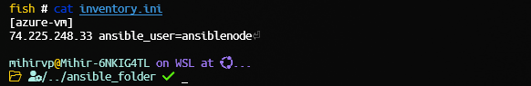
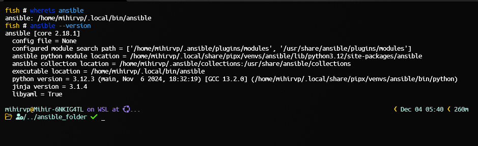
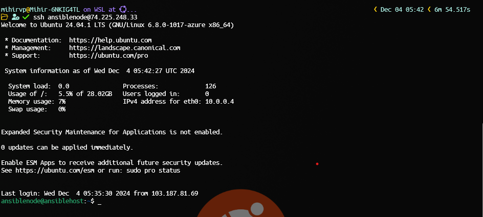
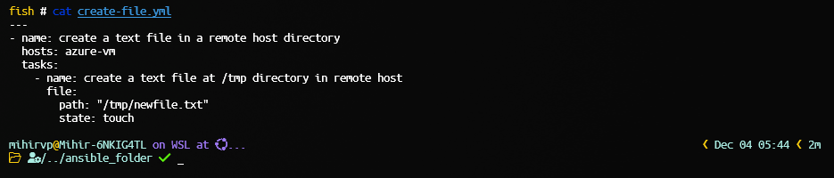
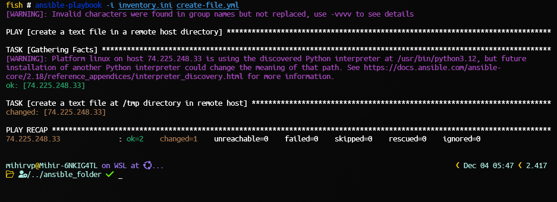
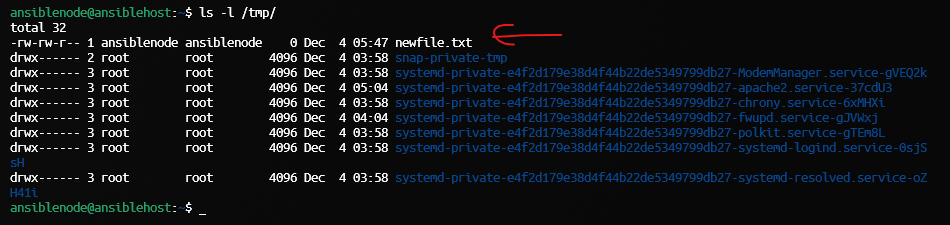
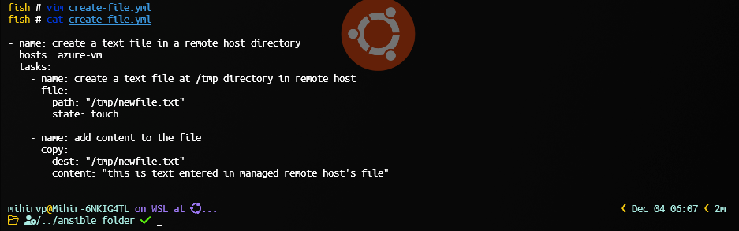
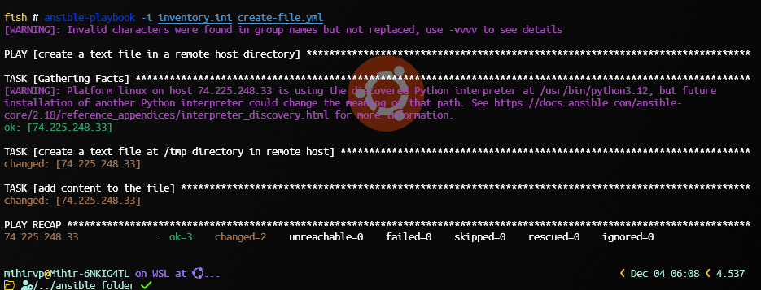
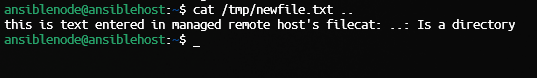

> [Go Home](../iac-labs.md)

# Objective: Explore the basics of configuration management and automation.

## Assignments:

-   File Deployment:
    -   Write a script to deploy a configuration file to a specific directory on multiple servers.

---

> For this assignment, I am using my **Ubuntu 24.04 WSL2** machine as the control node.

> And for the Manged host, I am creating an _Azure VM_ with **Ubuntu 22.04 server** OS.

---

### Prerequisites:

-   create a Inventory file with ip address of the managed host and username



### Task 1: Check Ansible installation and version on control node.

```bash
ansible --version
```



### Task 2: Check ssh connection to control node

```bash
ssh ansible_node@<VM-IP>
```



### Task 3: Create a Playbook to create a file on control node.

```bash
vim create-file.yml
# then
cat create-file.yml
```



### Task 4: Run the playbook

```bash
ansible-playbook create-file.yml
```



---

> Now, let's move to the managed host.

-   let's check if file is created on the managed host.



-   As we can see the file is created on the managed host at `/tmp` directory.

---

-   Now let's modify the playbook to add content to this file.



-   Now let's run the playbook again.



-   lets check the content of the file on the managed host.



> and the content is present on the managed host.

---
