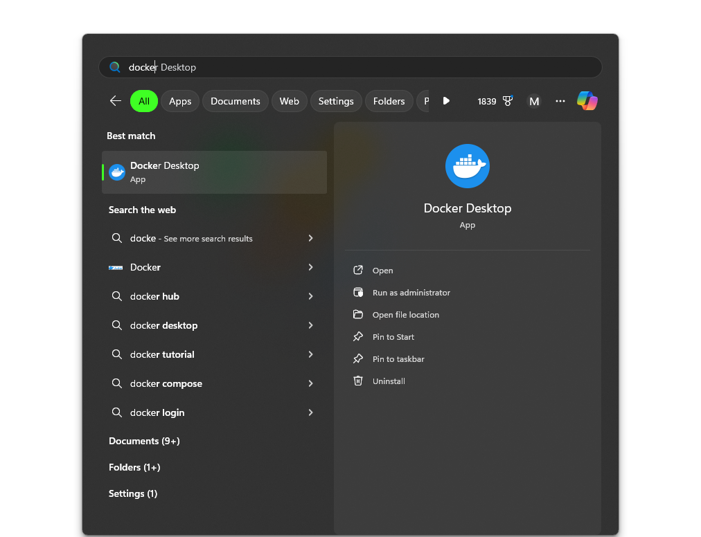

> [Go to Home](../docker-labs.md)

# Steps to install Docker on Microsoft Windows

## Step 1: Create a Docker Account.

1. Go to [Docker website](https://docker.com).
2. Click on sign up to create a new docker account.
3. After creating account, click on sign in to login to your docker account.
4. You will be presented with [Docker Home](https://app.docker.com/) website.

## Step 2: Download and install Docker desktop.

1. Go to [Docker Docs](https://docs.docker.com/) and click on **Get Docker** button.
2. Click on _Install Docker Desktop for Windows -x86_64_.
3. Download and Install by double clicking the MSI Package.
4. Choose **Install with WSL** for running docker desktop as WSL container machine.
5. After successful installation, Open Start Menu, type Docker Desktop and run.
6. 
7. After launch, Docker Desktop application displayed. You can also see an Docker Icon in the stats menu in Taskbar menu.
8. 

## Step 3: Run a Hello world Docker Container

1. This method is used to check if Docker is successfully installed and runs without any bugs, problems.
2. To run this container open PowerShell and run following commands.
    1. To check information about docker run `docker` or `docker version` commands.
    2. 
3. Now, to run the Hello World Container, run the following command.

```sh
docker run hello-world
```

4. This will pull the latest version of 'Hello World' container (if not stored on the machine) from the [docker hub]([Docker Hub Container Image Library | App Containerization](https://hub.docker.com/explore)) repository.
5. After successful creation of _hello-world_ container, the output will be something like this. 
6. And Docker Desktop will showcase like this: 
7. That is how to run the hello world docker container.!

---

# Next: [Common Docker Commands](../ACM-02/Common%20Docker%20Commands.md)
