> [Go to Home](../docker-labs.md)

# Section 1: General Commands.

1. Docker information

```powershell
docker
```

Output:
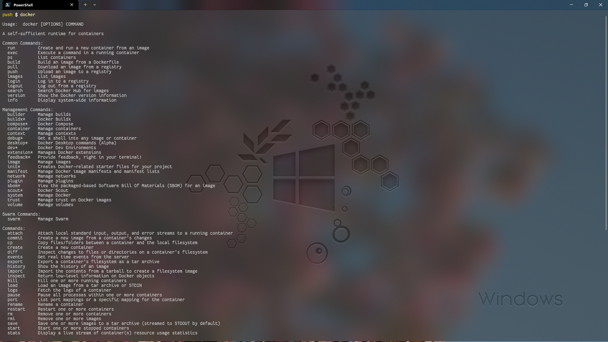 2. Docker Installation system information.

```powershell
docker info
```

output:
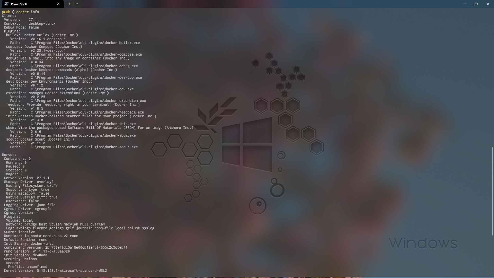 3. Docker version

```powershell
docker version
```

output:
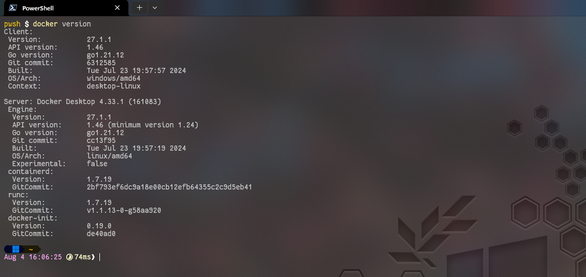

# Section 2: Image related commands.

1. search for **Ubuntu** Image.

```powershell
docker search ubuntu | docker search ubuntu:latest
```

output:
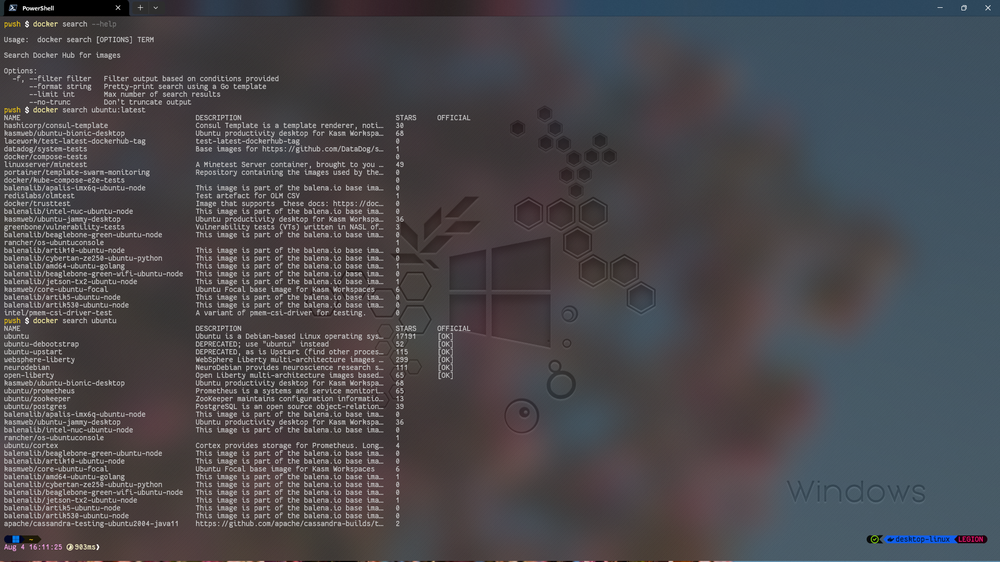 2. Searching **Ubuntu** image with filters on.

```powershell
docker search --filter is-official=true --filter stars=3 --limit 2 ubuntu
```

output:
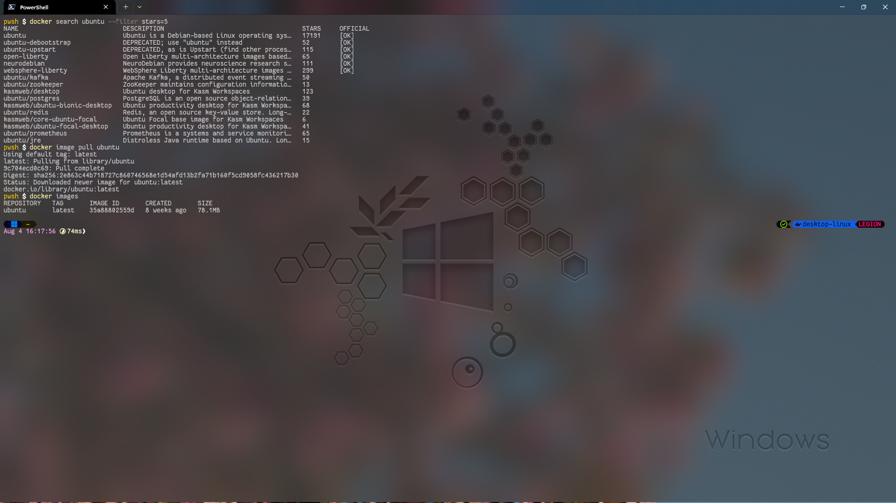

# Section 3: Pull image to your Docker registry.

1. Pull **Ubuntu** to your registry.

```powershell
docker pull ubuntu | docker image pull ubuntu
```

output:
 2. Pull **Ubuntu** with a _specific tag_.

```powershell
docker pull ubuntu:22.04
```

output:
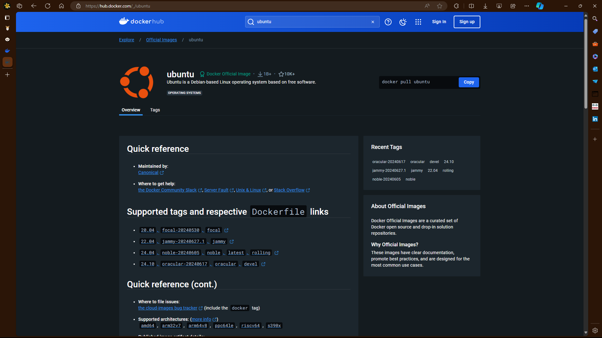
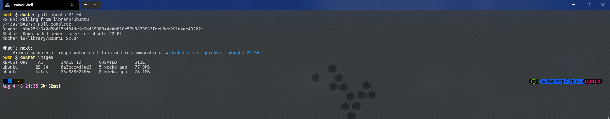 3. Pull more images

```powershell
docker pull nginx # A popular web server implementation
docker pull mysql # A popular relational database
```

output:
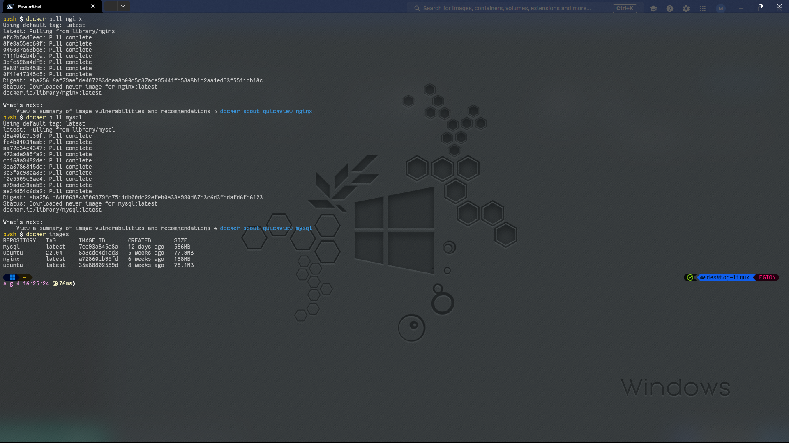
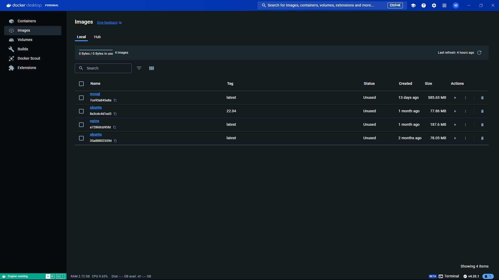 4. List all layers of images (no truncation)

```powershell
docker images --no-trunc
```

output:
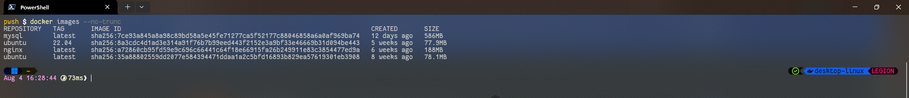 5. Remove All unused (dangling) images

```powershell
docker image prune
```

output:
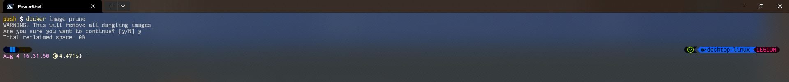 6. Remove all unused images by container

```powershell
docker image prune -a
```

output:
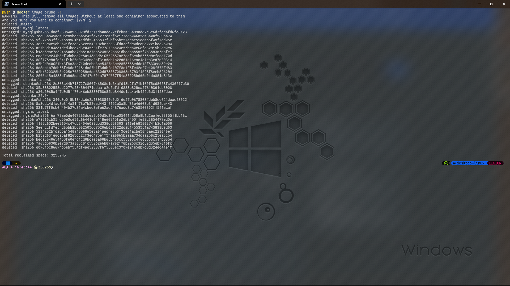

---

# Previous: [Steps To install Docker](../ACM-01/Steps%20To%20install%20Docker.md)

# Next: [Docker Networking and Inter Container Communication](../ACM-03/Docker%20Networking%20and%20Inter%20Container%20Communication.md)
