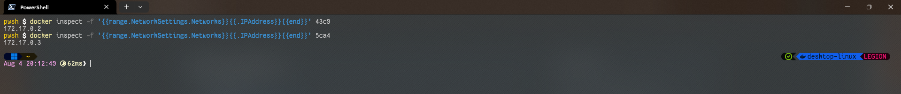

> [Go to Home](../docker-labs.md)

# Create Bridge Driver for 2 servers.

## Step 1: Test 2 containers.

```powershell
docker run -d --name server1 nginx:latest
docker run -d --name server2 nginx:latest
```

output:


## Step 2: Check connection to the containers with `curl` command.

```powershell
docker exec server1 curl localhost | docker exec <container-1-ID> curl localhost
# and for server 2
docker exec server2 curl localhost | docker exec <container-2-ID> curl localhost
```

output:

... as we can see, we can successfully access these html pages, showing servers running properly.

## Step 3: Try accessing Server1 from Server2

```powershell
docker exec server1 curl server2 | docker exec <container-1-ID> curl <container-2-ID>
# and alternatively
docker exec server2 curl server1 | docker exec <container-2-ID> curl <container-1-ID>
```

output:

... as you can see, we cannot access Container 1 page from Container 2 and vice versa.

But after getting IP addresses,

we can access each others pages, with container IP addresses.

\

## Step 4: Creating a Network Bridge, and access containers from each other.

### Step 4.1: Creating a Network Bridge.

```powershell
docker network create --driver bridge nginx-netw
# now this --flag value --> driver bridge is optional, since bridge is default driver, but we have to use for other network types.
```

output:


### Step 4.2: Launching new Containers using this network.

```powershell
docker run -d --name server3 --network nginx-netw nginx:latest
docker run -d --name server4 --network nginx-netw nginx:latest
```

output:


### Step 4.3: Test created containers with `curl` command.

```
docker exec server3 curl localhost
docker exec server4 curl localhost
```

output:

...as you can see both containers are running successfully.
Now, we can test the connection between 2 containers with `curl` command

### Step 4.4: Test connection between containers on same network.

```powershell
docker exec server3 curl server4 | docker exec server4 curl server3
```

output:

... and it works! since both containers share a same network, they can be accessed from any container from same network.

### Step 4.5: Access containers outside networks.

Now, lets try accessing previous containers from new server containers.
we can use previous containers' IP addresses.

```powershell
docker exec server3 curl <container-1-IP-address>
docker exec server3 curl <container-2-IP-address>
```

First, lets get containers' IP addresses.

output:

... _It does not work._ As both containers are on different networks, we cannot access them from outside.
But, we can access newly created network-shared containers from each other as follows:


## Step 5: Accessing container on Host machine.

> We can access docker containers on host machine by exposing their port (port forwarding).

For this, we can run containers with flag `-p` to access container's service port.

```powershell
docker run -d -p 8080:80 --name server5 nginx:latest
# here 8080 is port on the host machine, where port 80 of container service is exposed.
```


now, we can run `localhost:8080` in our browser, we can see the `nginx.html` homepage successfully.
output:


## Step 6: Clean Up

> After Successful implementation of network it is time to clean up our resources.

### Step 6.1: Stop and remove containers.

You can stop and remove containers with following commands

```powershell
docker stop <container_ID>
docker rm <container_ID>
```

but, removing them one by one can be tedious task on large list of running container.
thankfully, we can collect all the `<container_ID>`'s with the `-q` quiet flag, as:

```powershell
docker ps -aq # -a for all, -q for quiet
```


we can save these in a `PowerShell` variable and execute `stop` and `rm` commands in one go.


### Step 6.2: Remove unused and dangling images.

We can remove Images with `rmi` command.

```powershell
docker rmi <image_ID>
```


Here we can see all the layers of images `nginx` image was made of are removed.

### Step 6.3 Remove created networks.

We can remove created networks as follows

```powershell
docker network rm <network_ID>
```


---

# Previous: [Common Docker Commands](../ACM-02/Common%20Docker%20Commands.md)

# Next: [Docker Volumes](../ACM-04/Docker%20Volumes.md)
