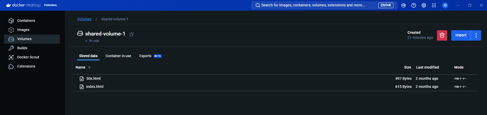

> [Go to Home](../docker-labs.md)

# Create Docker Volume and test file manipulation

## Part 1: Create and inspect Docker volume

1. Create docker volume with `docker volume create` command.
2. Check if volume is created successfully with `docker volume ls` command.

```powershell
pwsh  docker volume ls
DRIVER    VOLUME NAME
pwsh  docker volume create shared-volume-1
shared-volume-1
pwsh  docker volume ls
DRIVER    VOLUME NAME
local     shared-volume-1
```

3. Inspect created docker volume with `docker volume inspect` command.

```powershell
pwsh  docker volume inspect shared-volume-1
[
    {
        "CreatedAt": "2024-08-08T11:15:52Z",
        "Driver": "local",
        "Labels": null,
        "Mountpoint": "/var/lib/docker/volumes/shared-volume-1/_data",
        "Name": "shared-volume-1",
        "Options": null,
        "Scope": "local"
    }
]
```

## Part 2: Create a Nginx container and attach `html` folder to volume.

1. Create the container with `docker run ...` command.
2. Attach created volume to container using `... -v <your-volume>:<folder-to-nginx-html>` flags.
3. Show successful attachment of volume to container by showcasing contents of volume with `docker inspect` command again.

```powershell
pwsh  docker run -dp 8080:80 --name shared-nginx -v shared-volume-1:/usr/share/nginx/html nginx:latest
Unable to find image 'nginx:latest' locally
latest: Pulling from library/nginx
efc2b5ad9eec: Pull complete
8fe9a55eb80f: Pull complete
045037a63be8: Pull complete
7111b42b4bfa: Pull complete
3dfc528a4df9: Pull complete
9e891cdb453b: Pull complete
0f11e17345c5: Pull complete
Digest: sha256:6af79ae5de407283dcea8b00d5c37ace95441fd58a8b1d2aa1ed93f5511bb18c
Status: Downloaded newer image for nginx:latest
fae35d3c2fb804ce190ea38db4d5b1b7404906a17024ddcbcc7d2ddbfc633657

pwsh  docker container ls
CONTAINER ID   IMAGE          COMMAND                  CREATED          STATUS         PORTS                  NAMES
fae35d3c2fb8   nginx:latest   "/docker-entrypoint.…"   10 seconds ago   Up 9 seconds   0.0.0.0:8080->80/tcp   shared-nginx

pwsh  curl localhost:8080
<!DOCTYPE html>
<html>
<head>
<title>Welcome to nginx!</title>
<style>
html { color-scheme: light dark; }
body { width: 35em; margin: 0 auto;
font-family: Tahoma, Verdana, Arial, sans-serif; }
</style>
</head>
<body>
<h1>Welcome to nginx!</h1>
<p>If you see this page, the nginx web server is successfully installed and
working. Further configuration is required.</p>

<p>For online documentation and support please refer to
<a href="http://nginx.org/">nginx.org</a>.<br/>
Commercial support is available at
<a href="http://nginx.com/">nginx.com</a>.</p>

<p><em>Thank you for using nginx.</em></p>
</body>
</html>
```

output:


4. Create new `html` file inside nginx html folder, add some contents to it. showcase successful creation of the new file inside `...\nginx\html\` folder and showcase new file added inside docker volumes.

```powershell
pwsh  docker ps
CONTAINER ID   IMAGE          COMMAND                  CREATED         STATUS         PORTS                  NAMES
fae35d3c2fb8   nginx:latest   "/docker-entrypoint.…"   9 minutes ago   Up 9 minutes   0.0.0.0:8080->80/tcp   shared-nginx
pwsh  docker exec fae3 /bin/bash

pwsh  docker exec -it fae3 /bin/bash
root@fae35d3c2fb8:/# whoami
root
root@fae35d3c2fb8:/# echo "<h1>Hello from docker volume page at Nginx</h1>" > /usr/share/nginx/html/volume.html
root@fae35d3c2fb8:/# exit
exit

What's next:
    Try Docker Debug for seamless, persistent debugging tools in any container or image → docker debug fae3
    Learn more at https://docs.docker.com/go/debug-cli/

pwsh  curl localhost:8080/volume
<html>
<head><title>404 Not Found</title></head>
<body>
<center><h1>404 Not Found</h1></center>
<hr><center>nginx/1.27.0</center>
</body>
</html>
pwsh  curl localhost:8080/volume.html
<h1>Hello from docker volume page at Nginx</h1>
```

output:


## Step 3: Launch another container to share data with volume.

1. This time, create an Ubuntu container, and attach volume to `/data` directory inside Ubuntu container.

```powershell
pwsh  docker ps -a
CONTAINER ID   IMAGE          COMMAND                  CREATED       STATUS          PORTS                  NAMES
fae35d3c2fb8   nginx:latest   "/docker-entrypoint.…"   3 hours ago   Up 29 minutes   0.0.0.0:8080->80/tcp   shared-nginx

pwsh  docker run --name ubuntu-shared -v shared-volume-1:/data -it ubuntu:22.04 /bin/bash
Unable to find image 'ubuntu:22.04' locally
22.04: Pulling from library/ubuntu
3713021b0277: Pull complete
Digest: sha256:340d9b015b194dc6e2a13938944e0d016e57b9679963fdeb9ce021daac430221
Status: Downloaded newer image for ubuntu:22.04
root@69f01869cf2e:/#

```

3. Create a `HTML` file inside `/data` directory, modify it, check its output in Browser.
    1. First, check the files are present in `/data` directory.
    2. verify contents of shared `volume.html` file.

```powershell
root@69f01869cf2e:/# ls
bin  boot  data  dev  etc  home  lib  lib32  lib64  libx32  media  mnt  opt  proc  root  run  sbin  srv  sys  tmp  usr  var

root@69f01869cf2e:/# cd /data

root@69f01869cf2e:/data# ls
50x.html  index.html  volume.html

root@69f01869cf2e:/data# cat volume.html
<h1>Hello from docker volume page at Nginx</h1>
root@69f01869cf2e:/data#
```

4. Modify data from file `volume.html`

```powershell
root@69f01869cf2e:/data# echo "<h1 style="color:navy">Modified Hello from Docker Volume page at Ubuntu-nginx</h1>" > volume.html

root@69f01869cf2e:/data# cat volume.html
<h1 style=color:navy>Modified Hello from Docker Volume page at Ubuntu-nginx</h1>

root@69f01869cf2e:/data# exit
exit
```

output:


## Step 4: Cleanup

1. To clean resources, you can stop docker containers and remove them.
2. You stop all container at once by automating `stop` and `rm` commands for the container.
3. you can collect all the container IDs with `docker ps -aq` and pass the variables to `rm` and `stop` commands.

```powershell
pwsh  docker ps -a
CONTAINER ID   IMAGE          COMMAND                  CREATED          STATUS                     PORTS                  NAMES
69f01869cf2e   ubuntu:22.04   "/bin/bash"              24 minutes ago   Exited (0) 6 minutes ago                          ubuntu-shared
fae35d3c2fb8   nginx:latest   "/docker-entrypoint.…"   3 hours ago      Up 58 minutes              0.0.0.0:8080->80/tcp   shared-nginx

pwsh  docker ps -aq
69f01869cf2e
fae35d3c2fb8
pwsh  $containerIds = docker ps -aq

pwsh  $containerIds | ForEach-Object {docker rm $_}
69f01869cf2e
Error response from daemon: cannot remove container "/shared-nginx": container is running: stop the container before removing or force remove

pwsh  docker stop fae35
fae35
pwsh  $containerIds | ForEach-Object {docker rm $_}
Error response from daemon: No such container: 69f01869cf2e
fae35d3c2fb8

pwsh  docker ps -a
CONTAINER ID   IMAGE     COMMAND   CREATED   STATUS    PORTS     NAMES
```

4. Thus, all the containers have been removed successfully.
5. To remove volumes, run `docker volume rm` command.

```powershell
pwsh  docker volume ls
DRIVER    VOLUME NAME
local     shared-volume-1
pwsh  docker volume rm shared-volume-1
shared-volume-1
pwsh  docker volume ls
DRIVER    VOLUME NAME
```

6.  To remove Images, automate commands like containers. use `docker rmi ...` command to remove the images.

```powershell
pwsh  docker images
REPOSITORY   TAG       IMAGE ID       CREATED        SIZE
ubuntu       22.04     8a3cdc4d1ad3   5 weeks ago    77.9MB
nginx        latest    a72860cb95fd   6 weeks ago    188MB
ubuntu       latest    35a88802559d   2 months ago   78.1MB
pwsh  docker images -aq
8a3cdc4d1ad3
a72860cb95fd
35a88802559d

pwsh  $imageIds = docker images -aq
pwsh  $imageIds | ForEach-Object {docker rmi $_}
Untagged: ubuntu:22.04
Untagged: ubuntu@sha256:340d9b015b194dc6e2a13938944e0d016e57b9679963fdeb9ce021daac430221
Deleted: sha256:8a3cdc4d1ad3e314a91f76b7b99eed443f2152e3a9bf33e46669b31d094be443
Deleted: sha256:931b7ff0cb6f494b27d31a4cbec3efe62ac54676add9c7469560302f1541ecaf
Untagged: nginx:latest
Untagged: nginx@sha256:6af79ae5de407283dcea8b00d5c37ace95441fd58a8b1d2aa1ed93f5511bb18c
Deleted: sha256:a72860cb95fd59e9c696c66441c64f18e66915fa26b249911e83c3854477ed9a
Deleted: sha256:1188c692bee9694c47db34046023dbd938d88f303f216ef689863741b2d1a900
Deleted: sha256:3eefccfd7e5fd8bbb2bd982509dc79206b056f22dd2b14553951a743833b0d09
Deleted: sha256:5234252bfd2bba1548a4998869e9a01aedfe3b319ce61acbe98f8aec223640e7
Deleted: sha256:b292d631e6ca5af8269dc2cf3ec47be1f9faa0865b2aaa794daa2b8c25ea8cb4
Deleted: sha256:beda8840654459fe0efc1cd0bcae6a00b65b469cc999ebc41608b53c51fb93b4
Deleted: sha256:7a69d5090b2e7d873a365c81c590b2e6b87a702178b22b3c32c50d35eb7616fc
Deleted: sha256:e0781bc8667fb5ebf954df4ae52997f6f5568ec9f07e21e5db7c9d324ed41e1f
Untagged: ubuntu:latest
Untagged: ubuntu@sha256:2e863c44b718727c860746568e1d54afd13b2fa71b160f5cd9058fc436217b30
Deleted: sha256:35a88802559dd2077e584394471ddaa1a2c5bfd16893b829ea57619301eb3908
Deleted: sha256:a30a5965a4f7d9d5ff76a46eb8939f58e95be844de1ac4a4b452d5d31158fdea
```

7. This deletes all the Images and images layers. thus, cleanup operations is successful.

---

# Previous: [Docker Networking and Inter Container Communication](../ACM-03/Docker%20Networking%20and%20Inter%20Container%20Communication.md)

# Next: [Creating Dockerfile for Web Application.](../ACM-05/Creating%20Dockerfile%20for%20Web%20Application..md)
