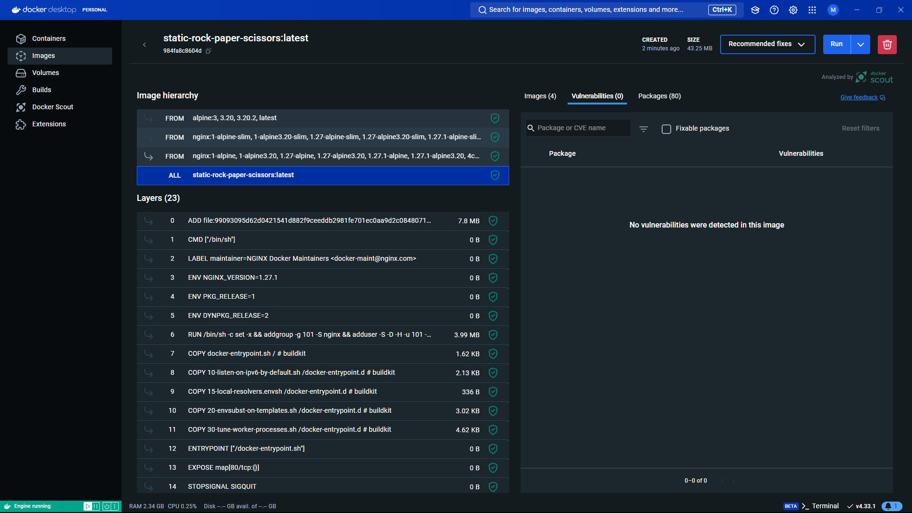
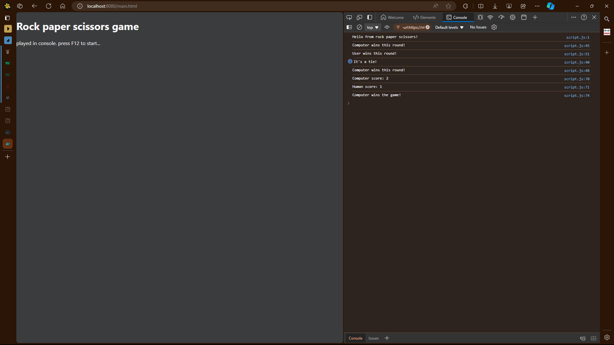

> [Go to Home](../docker-labs.md)

**Dockerfile** is a file to build the docker image to create deployable containers.
Here, you define all the instructions for building images.

1. Here I am deploying a static website so I am copying files to html directory.
2. I am using a Nginx web server as base image for static deployment.

```dockerfile
FROM nginx:alpine

COPY index.html /usr/share/nginx/html/main.html
COPY style.css /usr/share/nginx/html/style.css
COPY script.js /usr/share/nginx/html/script.js

EXPOSE 80
```

3. Run `docker build image_name` command to build the image.

```PowerShell
pwsh # cat .\Dockerfile
FROM nginx:alpine

COPY index.html /usr/share/nginx/html/main.html
COPY style.css /usr/share/nginx/html/style.css
COPY script.js /usr/share/nginx/html/script.js

EXPOSE 80
pwsh # docker build -t static-rock-paper-scissors .
[+] Building 7.4s (10/10) FINISHED                                                                                                                                                                                     docker:desktop-linux
 => [internal] load build definition from Dockerfile                                                                                                                                                                                   0.0s
 => => transferring dockerfile: 218B                                                                                                                                                                                                   0.0s
 => [internal] load metadata for docker.io/library/nginx:alpine                                                                                                                                                                        2.7s
 => [auth] library/nginx:pull token for registry-1.docker.io                                                                                                                                                                           0.0s
 => [internal] load .dockerignore                                                                                                                                                                                                      0.0s
 => => transferring context: 51B                                                                                                                                                                                                       0.0s
 => [1/4] FROM docker.io/library/nginx:alpine@sha256:c04c18adc2a407740a397c8407c011fc6c90026a9b65cceddef7ae5484360158                                                                                                                  4.4s
 => => resolve docker.io/library/nginx:alpine@sha256:c04c18adc2a407740a397c8407c011fc6c90026a9b65cceddef7ae5484360158                                                                                                                  0.0s
 => => sha256:7f5898476db744b7e3d5f25c7533b4285e21cf2025610f339cb32bf39bebcfe4 1.76MB / 1.76MB                                                                                                                                         0.7s
 => => sha256:c04c18adc2a407740a397c8407c011fc6c90026a9b65cceddef7ae5484360158 9.07kB / 9.07kB                                                                                                                                         0.0s
 => => sha256:0c57fe90551cfd8b7d4d05763c5018607b296cb01f7e0ff44b7d047353ed8cc0 2.50kB / 2.50kB                                                                                                                                         0.0s
 => => sha256:0f0eda053dc5c4c8240f11542cb4d200db6a11d476a4189b1eb0a3afa5684a9a 11.23kB / 11.23kB                                                                                                                                       0.0s
 => => sha256:45f552c78c312f2b711135f5af71a2eb06e223246d13cae7bf3a15e447136045 629B / 629B                                                                                                                                             0.8s
 => => sha256:62a896bb4a21c26afb24814d77cc345822fd8b03255bb9f940a0707daa9f2ff6 955B / 955B                                                                                                                                             0.3s
 => => sha256:532b9a30583c1bf82204f3cbc8054882bace1669cc85fdcb45b8f88b4db82833 393B / 393B                                                                                                                                             1.1s
 => => extracting sha256:7f5898476db744b7e3d5f25c7533b4285e21cf2025610f339cb32bf39bebcfe4                                                                                                                                              0.1s
 => => sha256:41c49cbde6a69c2861d4443a90e47a59e906386088b706d32aba1091d0f262b0 1.21kB / 1.21kB                                                                                                                                         1.0s
 => => sha256:9da224fdd4124c20879a425f59ee3d7e9aeccf37356692f37cd7736e38c2efd2 1.40kB / 1.40kB                                                                                                                                         1.0s
 => => extracting sha256:45f552c78c312f2b711135f5af71a2eb06e223246d13cae7bf3a15e447136045                                                                                                                                              0.0s
 => => extracting sha256:62a896bb4a21c26afb24814d77cc345822fd8b03255bb9f940a0707daa9f2ff6                                                                                                                                              0.0s
 => => sha256:35b039ba2bc54667ad0fdce04367ea93ed097b0506cda323e280e1ed31f29b31 13.19MB / 13.19MB                                                                                                                                       3.8s
 => => extracting sha256:532b9a30583c1bf82204f3cbc8054882bace1669cc85fdcb45b8f88b4db82833                                                                                                                                              0.0s
 => => extracting sha256:41c49cbde6a69c2861d4443a90e47a59e906386088b706d32aba1091d0f262b0                                                                                                                                              0.0s
 => => extracting sha256:9da224fdd4124c20879a425f59ee3d7e9aeccf37356692f37cd7736e38c2efd2                                                                                                                                              0.0s
 => => extracting sha256:35b039ba2bc54667ad0fdce04367ea93ed097b0506cda323e280e1ed31f29b31                                                                                                                                              0.4s
 => [internal] load build context                                                                                                                                                                                                      0.0s
 => => transferring context: 3.38kB                                                                                                                                                                                                    0.0s
 => [2/4] COPY index.html /usr/share/nginx/html/main.html                                                                                                                                                                              0.1s
 => [3/4] COPY style.css /usr/share/nginx/html/style.css                                                                                                                                                                               0.0s
 => [4/4] COPY script.js /usr/share/nginx/html/script.js                                                                                                                                                                               0.0s
 => exporting to image                                                                                                                                                                                                                 0.1s
 => => exporting layers                                                                                                                                                                                                                0.0s
 => => writing image sha256:984fa8c8604d6af95923745bc8652aea236c0793b6fe2b30cb3047f447c80e81                                                                                                                                           0.0s
 => => naming to docker.io/library/static-rock-paper-scissors                                                                                                                                                                          0.0s

View build details: docker-desktop://dashboard/build/desktop-linux/desktop-linux/vfvk0tbyow7sm3d6v6cg5gl5z

What's next:
    View a summary of image vulnerabilities and recommendations → docker scout quickview
pwsh # docker images
REPOSITORY                   TAG       IMAGE ID       CREATED         SIZE
static-rock-paper-scissors   latest    984fa8c8604d   9 seconds ago   43.3MB
```

 4. Create docker container from the docker image with `docker run` command.

```powershell
pwsh # docker ps
CONTAINER ID   IMAGE                        COMMAND                  CREATED          STATUS          PORTS                  NAMES
6cbc20597641   static-rock-paper-scissors   "/docker-entrypoint.…"   41 seconds ago   Up 40 seconds   0.0.0.0:8080->80/tcp   static-rock-paper-scissors-web
pwsh # curl localhost:8080/main.html
<!DOCTYPE html>
<html lang="en">
    <head>
        <meta charset="UTF-8" />
        <meta
            name="viewport"
            content="width=device-width, initial-scale=1.0"
        />
        <link
            rel="stylesheet"
            href="./style.css"
        />
        <title>Rock paper scissors</title>
    </head>
    <body>
        <h1>Rock paper scissors game</h1>
        <p>played in console. press F12 to start...</p>
        <script src="./script.js"></script>
    </body>
</html>
```

5. You can see the website on `localhost:8080/main.html` on the browser.
   

### Good Practices:

1. added a `.dockerignore` file to skip unwanted files from build.

# Previous: [Docker Volumes](../ACM-04/Docker%20Volumes.md)

# Next: [Writing Docker Compose file for Multi-Container App](../ACM-06/Writing%20Docker%20Compose%20file%20for%20Multi-Container%20App.md)
