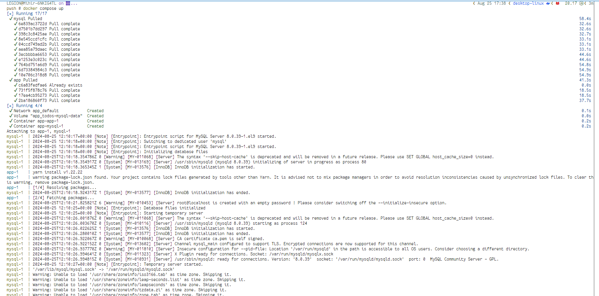
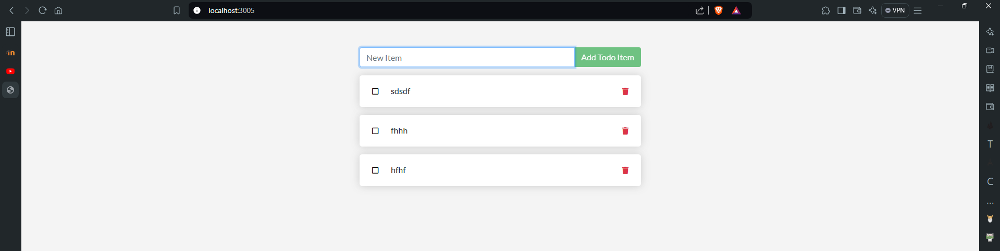

> [Go to Home](../docker-labs.md)

**Docker Compose** is a Tool to manage apps with Multi container environments, where each container is a distinct service for specific use.
**Docker compose** helps setting up these environments with a declarative way, as a `.yaml` file, which with simple `docker compose` commands, can easily automate the container management instructions.
You have to mention (declare) the setup for each service in compose file as service property.

Here, I am creating a Docker compose file for a 'todo app' which has frontend part for GUI that shows tasks on browser and d Database that stores the Task on a database.
Here is the compose file for the app.

```yaml
services:
    app:
        image: node:20-alpine
        command: sh -c "yarn install && yarn run dev"
        ports:
            - '3005:3000'
        working_dir: /app
        volumes:
            - ./:/app
        environment:
            MYSQL_HOST: mysql
            MYSQL_USER: root
            MYSQL_PASSWORD: secret
            MYSQL_DB: todos
    mysql:
        image: mysql:8.0
        volumes:
            - todos-mysql-data:/var/lib/mysql
        environment:
            MYSQL_ROOT_PASSWORD: secret
            MYSQL_DATABASE: todos
volumes:
    todos-mysql-data:
```

Here is Explanation for the compose file.

1. _Services_ : These are the main container definitions, were you define microservice containers.
    1. **app**: Frontend service.
        1. Image: base image for app service. Here I have chosen Node.js v20 - Alpine Linux image.
        2. command: initial command to run after just starting the container.
        3. Ports: mapping service ports to the localhost machine.
        4. working_dir: working directory on container from which app will run.
        5. volumes: Here I am binding current directory to /app directory so that any changes in image will be reflected instantly.
        6. environment: The environment variables for running app. usually this is to be added in docker secrets but, for the context I am adding them here.
    2. **mysql**: MySQL database Image for creating container.
        1. image: base image for MySQL, here I am using MySQL v8.0
        2. volumes: create a docker volume to and attach the `/var/lib/mysql` folder for database persistence.
        3. environment: environment variables for MySQL Image.
2. Volumes: creating a volume for data persistence.

Now, with docker compose commands, we can run the multi container application.


Thus services are started successfully and we can see the app running on `localhost:3005` mapped port.


```powershell
pwsh # docker ps -a
CONTAINER ID   IMAGE            COMMAND                  CREATED         STATUS         PORTS                    NAMES
8e2f2baec6d0   mysql:8.0        "docker-entrypoint.s…"   3 minutes ago   Up 3 minutes   3306/tcp, 33060/tcp      app-mysql-1
04b9616df5e6   node:20-alpine   "docker-entrypoint.s…"   3 minutes ago   Up 3 minutes   0.0.0.0:3005->3000/tcp   app-app-1

pwsh # docker images
REPOSITORY   TAG         IMAGE ID       CREATED       SIZE
node         20-alpine   d58137ded569   3 days ago    133MB
mysql        8.0         7cd8c3640577   4 weeks ago   573MB

pwsh # docker volume ls
DRIVER    VOLUME NAME
local     app_todos-mysql-data
```

and here is database output for app.

```powershell
pwsh # docker exec -it 8e2f mysql -u root -p
Enter password:
Welcome to the MySQL monitor.  Commands end with ; or \g.
Your MySQL connection id is 10
Server version: 8.0.39 MySQL Community Server - GPL

Copyright (c) 2000, 2024, Oracle and/or its affiliates.

Oracle is a registered trademark of Oracle Corporation and/or its
affiliates. Other names may be trademarks of their respective
owners.

Type 'help;' or '\h' for help. Type '\c' to clear the current input statement.

mysql> show databases;
+--------------------+
| Database           |
+--------------------+
| information_schema |
| mysql              |
| performance_schema |
| sys                |
| todos              |
+--------------------+
5 rows in set (0.01 sec)

mysql> use todos;
Reading table information for completion of table and column names
You can turn off this feature to get a quicker startup with -A

Database changed
mysql> show tables
    -> ;
+-----------------+
| Tables_in_todos |
+-----------------+
| todo_items      |
+-----------------+
1 row in set (0.00 sec)

mysql> select * from todo_items;
+--------------------------------------+-------+-----------+
| id                                   | name  | completed |
+--------------------------------------+-------+-----------+
| 26e9473b-61bd-4409-8d6b-77321f1bc274 | sdsdf |         0 |
| 10eaea04-7646-4b2b-97c8-dd5e60b5a44c | fhhh  |         0 |
| 8ff75f3a-5236-4e11-b989-cf31f3596fde | hfhf  |         0 |
+--------------------------------------+-------+-----------+
3 rows in set (0.00 sec)

mysql>
```

now, with `docker compose down` command you can tear down everything.

```powershell
pwsh # docker compose down
[+] Running 3/3
 ✔ Container app-mysql-1  Removed                                                                                                                                                                                                          0.0s
 ✔ Container app-app-1    Removed                                                                                                                                                                                                          1.4s
 ✔ Network app_default    Removed                                                                                                                                                                                                          0.2s
```

# Previous: [Creating Dockerfile for Web Application.](../ACM-05/Creating%20Dockerfile%20for%20Web%20Application..md)

# Next: [Manage Services Clusters with Docker Swarm](../ACM-07/Manage%20Services%20Clusters%20with%20Docker%20Swarm.md)
