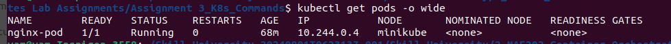
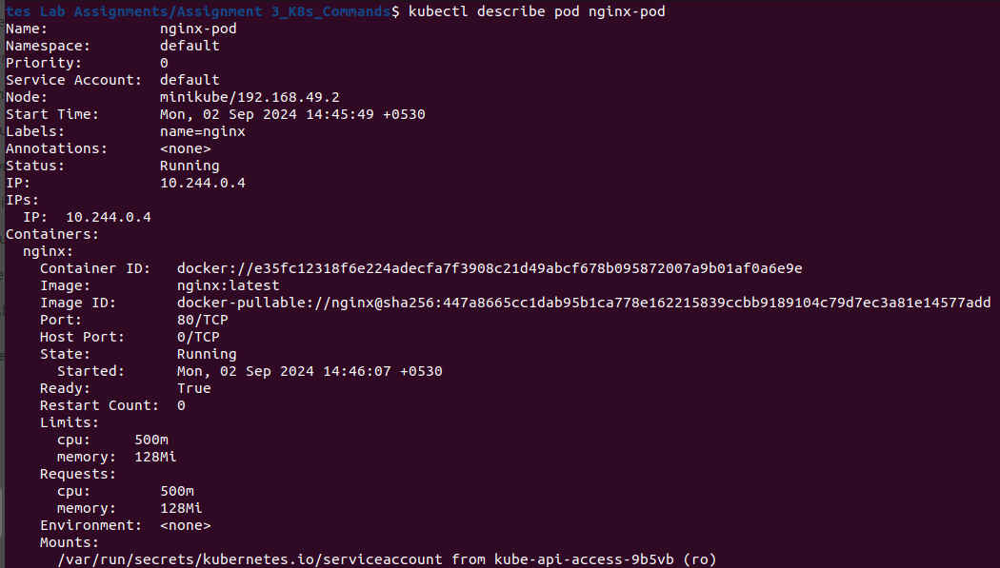
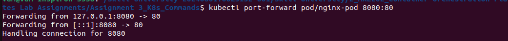

> [Go To home](../kubernetes-labs.md)

# Assignment No 3 B:

## Title: Kubernetes Commands

### 1. Setting Up Your Minikube Environment

Make sure Minikube is running. If it's not already started, open your terminal (Command Prompt or PowerShell on Windows) and start Minikube:

```bash
minikube start
```

### 2. Creating a Pod, Service, and Deployment

Let's start by creating the necessary YAML files for a Pod, Service, and Deployment.

**2.1. Create a Pod**
A **Pod** is the smallest deployable unit in Kubernetes. Let's create a simple Pod running an `nginx` web server.

1. Create a YAML file for the Pod:

Open a text editor and create a file named `nginx-pod.yaml` with the following content:

```yaml
apiVersion: v1
kind: Pod
metadata:
    name: nginx-pod
    labels:
        app: nginx
spec:
    containers:
        - name: nginx
          image: nginx:latest
          ports:
              - containerPort: 80
```

2. Create a YAMl file for the deployment

-   Open a text editor and create a file named `nginx-deployment.yaml` with the following content:

```yaml
apiVersion: apps/v1
kind: Deployment
metadata:
    name: nginx-deployment
spec:
    replicas: 3
    selector:
        matchLabels:
            app: nginx
    template:
        metadata:
            labels:
                app: nginx
        spec:
            containers:
                - name: nginx
                  image: nginx:latest
                  resources:
                      limits:
                          memory: "128Mi"
                          cpu: "500m"
                  ports:
                      - containerPort: 80
```

3. Create a YAMl file for the service.

Open a text editor and create a file named `nginx-service.yaml` with the following content:

```yaml
apiVersion: v1
kind: Service
metadata:
    name: nginx-service
spec:
    selector:
        app: nginx
    ports:
        - protocol: TCP
          port: 80
          targetPort: 80
    type: NodePort
```

### How These YAML Files Work Together:

1. **Pod:** Defines a single nginx container running in a Pod.
2. **Deployment:** Manages multiple replicas (3 in this case) of the nginx Pod to ensure high availability.
3. **Service:** Exposes the nginx Pods to external traffic using a NodePort, allowing users to access the web server.

# learning kubectl commands!

`kubectl` is the command-line tool for interacting with a Kubernetes cluster. It allows you to deploy applications, inspect and manage cluster resources, and view logs. Mastering kubectl is essential for anyone working with Kubernetes.

## 1. What is kubectl?

-   `kubectl` is the primary command-line tool for Kubernetes.
-   It communicates with the Kubernetes API server to manage resources within a Kubernetes cluster.
-   Used for a wide range of tasks such as:
    1. Deploying applications
    2. Viewing logs
    3. Checking the status of resources
    4. Executing commands within a container
    5. Scaling applications
    6. Debugging issues, and much more.

## 2. Installing kubectl

Before we get started, make sure you have kubectl installed on your machine. You can install it following the guide: [Install and Set Up kubectl](https://kubernetes.io/docs/tasks/tools/install-kubectl-linux/).

(Note: `kubectl` comes out of the box installed with `minikube` build of Kubernetes.)

## 3. Basic kubectl Commands and Examples

Let's cover the most commonly used kubectl commands with practical examples and industry project scenarios.

### 3.2 Creating Resources

**IMPERAVITE WAY to Create a pod**
Create a Pod running the nginx container using an `imperative command` with kubectl, you can use the following command:

```bash
kubectl run nginx-pod1 --image=nginx:latest --restart=Never
```

**Explanation of the Command:**

-   `kubectl run`: Creates a new Pod or Deployment.
-   `nginx-pod`: The name of the Pod you want to create.
-   `--image=nginx`: Specifies the Docker image to use for the Pod, in this case, the official nginx image from Docker Hub.

kubectl apply: Creates or updates resources defined in a YAML or JSON configuration file.

#### Apply a configuration file to create a pod

`kubectl apply -f nginx-pod.yaml`

```bash
fish # kubectl apply -f nginx-pod.yaml
pod/nginx-pod created
fish # kubectl get pods
NAME        READY   STATUS              RESTARTS   AGE
nginx-pod   0/1     ContainerCreating   0          6s
```

#### Apply a configuration file to create a deployment

`kubectl apply -f nginx-deployment.yaml`

```bash
fish # kubectl apply -f nginx-deployment.yaml
deployment.apps/nginx-deployment created
fish # kubectl get deployment
NAME               READY   UP-TO-DATE   AVAILABLE   AGE
nginx-deployment   3/3     3            3           13s
```

#### Apply a configuration file in a specific namespace

`kubectl apply -f nginx-service.yaml`

```bash
fish # kubectl apply -f nginx-service.yaml
service/nginx-service created
fish # kubectl get service
NAME            TYPE        CLUSTER-IP       EXTERNAL-IP   PORT(S)        AGE
kubernetes      ClusterIP   10.96.0.1        <none>        443/TCP        5d4h
nginx-service   NodePort    10.110.184.254   <none>        80:31758/TCP   80s
```

### 3.1. Viewing Resources in the Cluster

-   kubectl get: Displays information about Kubernetes resources.

#### Get a list of all pods in the default namespace

`kubectl get pods`

```sh
fish # kubectl get pods
NAME                                READY   STATUS    RESTARTS   AGE
nginx-deployment-7d85d66c99-58jdh   1/1     Running   0          6m29s
nginx-deployment-7d85d66c99-rs6ln   1/1     Running   0          6m29s
nginx-deployment-7d85d66c99-vzxvm   1/1     Running   0          6m29s
nginx-pod                           1/1     Running   0          7m11s
```

#### Get all services in the default namespace

`kubectl get services`

```sh
fish # kubectl get services
NAME            TYPE        CLUSTER-IP       EXTERNAL-IP   PORT(S)        AGE
kubernetes      ClusterIP   10.96.0.1        <none>        443/TCP        5d4h
nginx-service   NodePort    10.110.184.254   <none>        80:31758/TCP   7m43s
```

#### Get all deployments in a specific namespace

`kubectl get deployments`

```sh
fish # kubectl get deployment
NAME               READY   UP-TO-DATE   AVAILABLE   AGE
nginx-deployment   3/3     3            3           9m1s
```

#### Get all nodes in the cluster

`kubectl get nodes`

```sh
fish # kubectl get nodes
NAME       STATUS   ROLES           AGE    VERSION
minikube   Ready    control-plane   5d4h   v1.31.0
```

#### Get detailed information about a specific pod

`kubectl get pod <pod-name> -o wide`

```sh
ish # kubectl get pod nginx-pod -o wide
NAME        READY   STATUS    RESTARTS   AGE   IP            NODE       NOMINATED NODE   READINESS GATES
nginx-pod   1/1     Running   0          13m   10.244.0.12   minikube   <none>           <none>
```

### 3.2 Verify that the Pods are Running

**1. First, ensure that your Pods are running properly.**

Run the following command to check the status of your Pods:

```bash
kubectl get pods
```

You should see output that looks like this:


```sh
fish # kubectl get pods
NAME                                READY   STATUS    RESTARTS   AGE
nginx-deployment-7d85d66c99-58jdh   1/1     Running   0          14m
nginx-deployment-7d85d66c99-rs6ln   1/1     Running   0          14m
nginx-deployment-7d85d66c99-vzxvm   1/1     Running   0          14m
nginx-pod                           1/1     Running   0          15m
```

If the STATUS is "Running," your Pods are up and running.

**2. Describe the Pod to Check for Issues**

If the Pod is not in the "Running" state, use the kubectl describe command to get more details:

```bash
kubectl describe pod <pod-name>
example:
kubectl describe pod nginx-pod
```

Replace <pod-name> with the actual name of the Pod you see in the output of kubectl get pods.

This command will provide detailed information about the Pod, including events, errors, warnings, or issues related to the Pod's scheduling, container image pulling, or other status messages.


```sh
fish # kubectl describe pod nginx-pod
Name:             nginx-pod
Namespace:        default
Priority:         0
Service Account:  default
Node:             minikube/192.168.49.2
Start Time:       Fri, 15 Nov 2024 11:49:39 +0530
Labels:           name=nginx
Annotations:      <none>
Status:           Running
IP:               10.244.0.12
IPs:
  IP:  10.244.0.12
Containers:
  nginx:
    Container ID:   docker://c69ea9609372bd8144439cf4faf4244124448eace08d56cddd811439a43ae2f0
    Image:          nginx:latest
    Image ID:       docker-pullable://nginx@sha256:bc5eac5eafc581aeda3008b4b1f07ebba230de2f27d47767129a6a905c84f470
    Port:           80/TCP
    Host Port:      0/TCP
    State:          Running
      Started:      Fri, 15 Nov 2024 11:50:03 +0530
    Ready:          True
    Restart Count:  0
    Limits:
      cpu:     500m
      memory:  128Mi
    Requests:
      cpu:        500m
      memory:     128Mi
    Environment:  <none>
    Mounts:
      /var/run/secrets/kubernetes.io/serviceaccount from kube-api-access-97vcd (ro)
Conditions:
  Type                        Status
  PodReadyToStartContainers   True
  Initialized                 True
  Ready                       True
  ContainersReady             True
  PodScheduled                True
Volumes:
  kube-api-access-97vcd:
    Type:                    Projected (a volume that contains injected data from multiple sources)
    TokenExpirationSeconds:  3607
    ConfigMapName:           kube-root-ca.crt
    ConfigMapOptional:       <nil>
    DownwardAPI:             true
QoS Class:                   Guaranteed
Node-Selectors:              <none>
Tolerations:                 node.kubernetes.io/not-ready:NoExecute op=Exists for 300s
                             node.kubernetes.io/unreachable:NoExecute op=Exists for 300s
Events:
  Type    Reason     Age   From               Message
  ----    ------     ----  ----               -------
  Normal  Scheduled  16m   default-scheduler  Successfully assigned default/nginx-pod to minikube
  Normal  Pulling    16m   kubelet            Pulling image "nginx:latest"
  Normal  Pulled     15m   kubelet            Successfully pulled image "nginx:latest" in 22.234s (22.234s including waiting). Image size: 191670156 bytes.
  Normal  Created    15m   kubelet            Created container nginx
  Normal  Started    15m   kubelet            Started container nginx
```

**3. Test the Pod Using kubectl port-forward**

To test the application running inside the Pod, you can use kubectl port-forward to forward a local port on your machine to a port on the Pod.

-   Find the Pod Name:
    You should already have the Pod name from the kubectl get pods output. Let's assume the Pod is named nginx-pod.

-   Run the kubectl port-forward Command:

    Forward a local port (e.g., 8080) to the Pod's port (80 for nginx):

    ```bash
    kubectl port-forward pod/nginx-pod 8080:80
    ```

    -   `pod/nginx-pod`: The name of your Pod.
    -   `8080:80`: Maps port 8080 on your local machine to port 80 on the Pod.



```sh
fish # kubectl port-forward pods/nginx-pod 8080:80
Forwarding from 127.0.0.1:8080 -> 80
Forwarding from [::1]:8080 -> 80
Handling connection for 8080
...
```

This command creates a local port forwarding session to the Pod. The terminal will display a message indicating that the port forwarding is active.

-   Access the Application via Browser or curl:

    -   Browser: Open a web browser and go to http://localhost:8080.
    -   Command Line (curl):
        Run:

    ```bash
    curl http://localhost:8080
    ```

    ```sh
    fish # curl localhost:8080
      <!DOCTYPE html>
      <html>
      <head>
      <title>Welcome to nginx!</title>
      <style>
      html { color-scheme: light dark; }
      body { width: 35em; margin: 0 auto;
      font-family: Tahoma, Verdana, Arial, sans-serif; }
      </style>
      </head>
      <body>
      <h1>Welcome to nginx!</h1>
      <p>If you see this page, the nginx web server is successfully installed and
      working. Further configuration is required.</p>

      <p>For online documentation and support please refer to
      <a href="http://nginx.org/">nginx.org</a>.<br/>
      Commercial support is available at
      <a href="http://nginx.com/">nginx.com</a>.</p>

      <p><em>Thank you for using nginx.</em></p>
      </body>
      </html>
    ```

    If everything is working correctly, you should see the default nginx welcome page or the output of your application.

**4. Check Pod Logs**
To ensure the application is running properly, you can also check the logs of the Pod:

```bash
kubectl logs <pod-name>
exapmle:
kubectl logs nginx-pod
```


This command shows the logs generated by the application running inside the Pod (in this case, nginx). Logs can help you identify any issues or confirm that the application is serving traffic correctly.

```sh
fish # kubectl logs pods/nginx-pod
/docker-entrypoint.sh: /docker-entrypoint.d/ is not empty, will attempt to perform configuration
/docker-entrypoint.sh: Looking for shell scripts in /docker-entrypoint.d/
/docker-entrypoint.sh: Launching /docker-entrypoint.d/10-listen-on-ipv6-by-default.sh
10-listen-on-ipv6-by-default.sh: info: Getting the checksum of /etc/nginx/conf.d/default.conf
10-listen-on-ipv6-by-default.sh: info: Enabled listen on IPv6 in /etc/nginx/conf.d/default.conf
/docker-entrypoint.sh: Sourcing /docker-entrypoint.d/15-local-resolvers.envsh
/docker-entrypoint.sh: Launching /docker-entrypoint.d/20-envsubst-on-templates.sh
/docker-entrypoint.sh: Launching /docker-entrypoint.d/30-tune-worker-processes.sh
/docker-entrypoint.sh: Configuration complete; ready for start up
2024/11/15 06:20:03 [notice] 1#1: using the "epoll" event method
2024/11/15 06:20:03 [notice] 1#1: nginx/1.27.2
2024/11/15 06:20:03 [notice] 1#1: built by gcc 12.2.0 (Debian 12.2.0-14)
2024/11/15 06:20:03 [notice] 1#1: OS: Linux 6.10.11-linuxkit
2024/11/15 06:20:03 [notice] 1#1: getrlimit(RLIMIT_NOFILE): 1048576:1048576
2024/11/15 06:20:03 [notice] 1#1: start worker processes
2024/11/15 06:20:03 [notice] 1#1: start worker process 29
2024/11/15 06:20:03 [notice] 1#1: start worker process 30
2024/11/15 06:20:03 [notice] 1#1: start worker process 31
2024/11/15 06:20:03 [notice] 1#1: start worker process 32
2024/11/15 06:20:03 [notice] 1#1: start worker process 33
2024/11/15 06:20:03 [notice] 1#1: start worker process 34
2024/11/15 06:20:03 [notice] 1#1: start worker process 35
2024/11/15 06:20:03 [notice] 1#1: start worker process 36
2024/11/15 06:20:03 [notice] 1#1: start worker process 37
2024/11/15 06:20:03 [notice] 1#1: start worker process 38
2024/11/15 06:20:03 [notice] 1#1: start worker process 39
2024/11/15 06:20:03 [notice] 1#1: start worker process 40
127.0.0.1 - - [15/Nov/2024:06:37:31 +0000] "GET / HTTP/1.1" 200 615 "-" "Mozilla/5.0 (X11; Linux x86_64) AppleWebKit/537.36 (KHTML, like Gecko) Chrome/130.0.0.0 Safari/537.36" "-"
2024/11/15 06:37:31 [error] 29#29: *1 open() "/usr/share/nginx/html/favicon.ico" failed (2: No such file or directory), client: 127.0.0.1, server: localhost, request: "GET /favicon.ico HTTP/1.1", host: "localhost:8080", referrer: "http://localhost:8080/"
127.0.0.1 - - [15/Nov/2024:06:37:31 +0000] "GET /favicon.ico HTTP/1.1" 404 555 "http://localhost:8080/" "Mozilla/5.0 (X11; Linux x86_64) AppleWebKit/537.36 (KHTML, like Gecko) Chrome/130.0.0.0 Safari/537.36" "-"
127.0.0.1 - - [15/Nov/2024:06:38:47 +0000] "GET / HTTP/1.1" 200 615 "-" "curl/8.11.0" "-"
```

**5. Alternative - Create a Temporary Pod to Test Connectivity**

You can also create a temporary Pod to check connectivity to your nginx Pod:

```bash
kubectl run test-pod --rm -it --image=busybox -- /bin/sh
```

```sh
fish # kubectl run test-pod --rm -it --image=busybox -- /bin/sh
If you don't see a command prompt, try pressing enter.
/ #
/ #
/ # pwd
/
/ # ls
```

This command creates a temporary Pod (test-pod) using the busybox image and opens a shell in it. From within the shell, you can test connectivity to your nginx Pod:

Ping the Pod IP:

```bash
ping <nginx-pod-ip>
/ # ping 10.244.0.12
PING 10.244.0.12 (10.244.0.12): 56 data bytes
64 bytes from 10.244.0.12: seq=0 ttl=64 time=0.112 ms
64 bytes from 10.244.0.12: seq=1 ttl=64 time=0.064 ms
64 bytes from 10.244.0.12: seq=2 ttl=64 time=0.086 ms
64 bytes from 10.244.0.12: seq=3 ttl=64 time=0.061 ms
64 bytes from 10.244.0.12: seq=4 ttl=64 time=0.073 ms
64 bytes from 10.244.0.12: seq=5 ttl=64 time=0.063 ms
^C
--- 10.244.0.12 ping statistics ---
6 packets transmitted, 6 packets received, 0% packet loss
round-trip min/avg/max = 0.061/0.076/0.112 ms
/ #
```

Use curl to Check HTTP Connectivity:

```bash
curl http://<nginx-pod-ip>:80
# here curl wasn't available in busybox container, so I used wget.
/ # wget 10.244.0.12:80
Connecting to 10.244.0.12:80 (10.244.0.12:80)
saving to 'index.html'
index.html           100% |****************************| 615  0:00:00 ETA
'index.html' saved
/ # cat index.html
<!DOCTYPE html>
<html>
<head>
<title>Welcome to nginx!</title>
<style>
html { color-scheme: light dark; }
body { width: 35em; margin: 0 auto;
font-family: Tahoma, Verdana, Arial, sans-serif; }
</style>
</head>
<body>
<h1>Welcome to nginx!</h1>
<p>If you see this page, the nginx web server is successfully installed and
working. Further configuration is required.</p>

<p>For online documentation and support please refer to
<a href="http://nginx.org/">nginx.org</a>.<br/>
Commercial support is available at
<a href="http://nginx.com/">nginx.com</a>.</p>

<p><em>Thank you for using nginx.</em></p>
</body>
</html>
```

Replace <nginx-pod-ip> with the IP address of your nginx Pod. You can get the Pod IP using:

```bash
kubectl get pod nginx-pod-abc123 -o wide
```

```sh
/ # exit
Session ended, resume using 'kubectl attach test-pod -c test-pod -i -t' command when the pod is running
pod "test-pod" deleted
```

**6. Deleting Resources**

-   `kubectl delete`: Deletes resources from a cluster.

#### Delete a pod

`kubectl delete pod <pod-name>`

```sh
fish # kubectl delete pod nginx-pod
pod "nginx-pod" deleted
```

#### Delete all pods with a specific label

`kubectl delete pods -l app=myapp`
_here we will be deleting service instead_

```sh
fish # kubectl delete service nginx-service
service "nginx-service" deleted
```

#### Delete a deployment

`kubectl delete deployment <deployment-name>`

```sh
fish # kubectl delete deployment nginx-deployment
deployment.apps "nginx-deployment" deleted
```

#### Delete a namespace

`kubectl delete namespace <namespace-name>`
~~we are not going to do this here~~

**7. Executing Commands in Containers**

-   `kubectl exec`: Executes a command in a container.

#### Open a shell inside a container

`kubectl exec -it <pod-name> -- /bin/bash`

```bash
fish # kubectl create -f tespod.yaml
pod/test-nginx-pod created

fish # kubectl exec -it test-nginx-pod -- /bin/bash
root@test-nginx-pod:/# ls
bin  boot  dev  docker-entrypoint.d  docker-entrypoint.sh  etc  home  lib  lib64  media  mnt  opt  proc  root  run  sbin  srv  sys  tmp  usr  var
root@test-nginx-pod:/# echo "<h3>hello from side</h3>" > /usr/share/nginx/html/side.html  #<-- remember this -->
root@test-nginx-pod:/# exit
```

#### Run a command inside a container

`kubectl exec <pod-name> -- ls /app`

```bash
fish # kubectl exec -it test-nginx-pod -- \ls /usr/share/nginx/html/
50x.html  index.html  side.html
```

**8. Port Forwarding**

-   `kubectl port-forward`: Forwards a local port to a port on a pod.

#### Forward port 8080 on localhost to port 80 on a pod

`kubectl port-forward pod/<pod-name> 8080:80`

```bash
fish # kubectl port-forward pods/test-nginx-pod 8080:80
Forwarding from 127.0.0.1:8080 -> 80
Forwarding from [::1]:8080 -> 80
...
```

_working output_

```bash
fish # curl localhost:8080/side.html
<h3>hello from side</h3>
```

-   kubectl port-forward is useful for accessing applications running inside the cluster from your local machine.
-   Developers often use it to test or debug applications that are only accessible within the cluster.

**9. Checking Resource Status**

-   `kubectl get events`: Displays recent events in the cluster.

`kubectl get events`

```sh
fish # kubectl get events | tail -20
12m         Normal    Created     pod/test-nginx-pod                      Created container test-nginx-pod
12m         Normal    Started     pod/test-nginx-pod                      Started container test-nginx-pod
24m         Normal    Scheduled   pod/test-pod                            Successfully assigned default/test-pod to minikube
23m         Normal    Pulling     pod/test-pod                            Pulling image "busybox:latest"
24m         Normal    Pulled      pod/test-pod                            Successfully pulled image "busybox:latest" in 2.692s (2.692s including waiting). Image size: 4269694 bytes.
23m         Normal    Created     pod/test-pod                            Created container test-pod
23m         Normal    Started     pod/test-pod                            Started container test-pod
24m         Normal    Pulled      pod/test-pod                            Successfully pulled image "busybox:latest" in 2.685s (2.685s including waiting). Image size: 4269694 bytes.
23m         Warning   BackOff     pod/test-pod                            Back-off restarting failed container test-pod in pod test-pod_default(63ddc490-6788-4ecc-87fb-aaeb86daaf58)
24m         Normal    Pulled      pod/test-pod                            Successfully pulled image "busybox:latest" in 2.553s (2.553s including waiting). Image size: 4269694 bytes.
23m         Normal    Pulled      pod/test-pod                            Successfully pulled image "busybox:latest" in 2.311s (2.311s including waiting). Image size: 4269694 bytes.
20m         Normal    Scheduled   pod/test-pod                            Successfully assigned default/test-pod to minikube
19m         Normal    Pulling     pod/test-pod                            Pulling image "busybox:latest"
```

-   Helps in monitoring the cluster for recent events, such as node failures, resource creation, or scaling activities.
-   Useful for auditing and detecting unexpected changes or failures.
