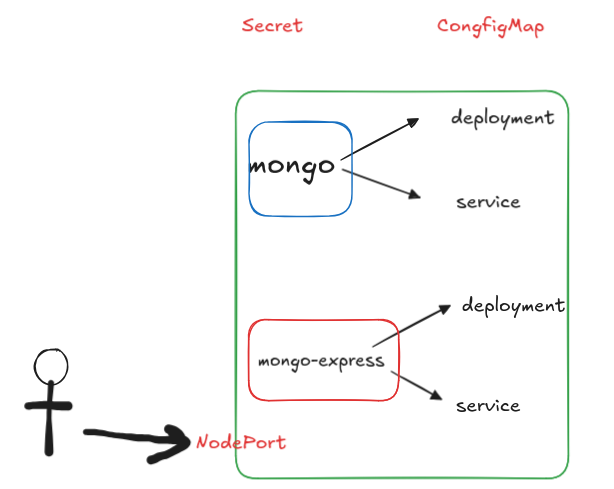
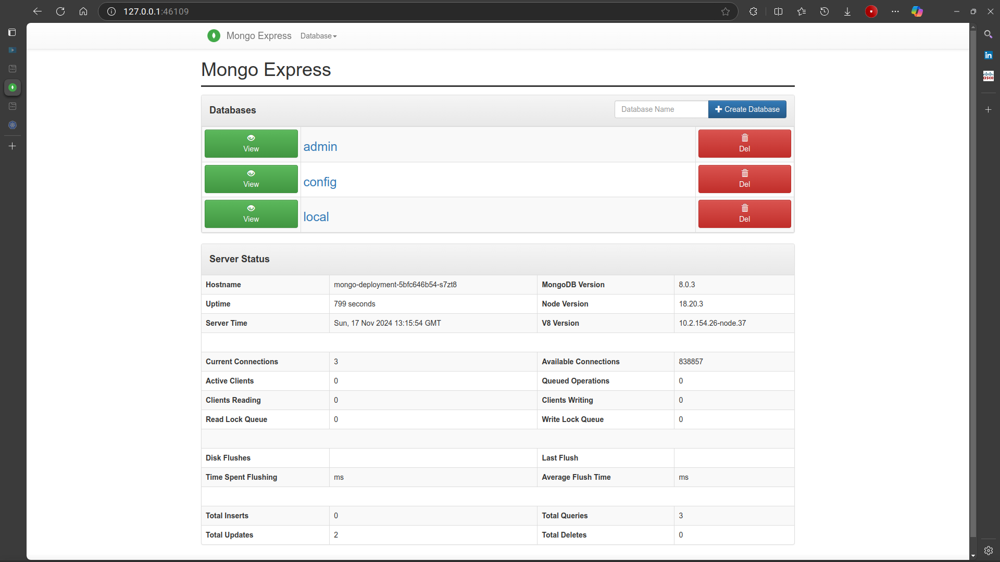

> [Go To home](../kubernetes-labs.md)

# Assignment No 5

## Title: Learn the kubernets service, secrete and configmap. Set up and run a Kubernetes project where mongo-express connects to a MongoDB instance.

### Overview of the Kubernetes Components

1. **Secret (secret.yaml)**: Stores the MongoDB credentials securely.
2. **ConfigMap (mongo-config.yaml)**: Stores the configuration data for connecting to MongoDB.
3. **MongoDB Deployment and Service (mongo-app.yaml)**: Defines the MongoDB deployment and its corresponding service.
4. **Mongo-Express Deployment and Service (express-app.yaml)**: Defines the mongo-express deployment and its corresponding service.

### Project Architecture



### Step-by-Step Instructions

1. Create Secret for MongoDB Credentials

First, create a secret to store the MongoDB username and password. Kubernetes secrets help keep sensitive information, like credentials, secure.

**File:** secret.yaml

```yaml
apiVersion: v1
kind: Secret
metadata:
    name: mongo-secret
type: Opaque
data:
    mongo-user: bW9uZ291c2Vy # base64-encoded value for "mongouser"
    mongo-password: bW9uZ29wYXNzd29yZA== # base64-encoded value for "mongopassword"
```

-   **Explanation:**
-   `mongo-user` and `mongo-password` are `base64-encoded` values for mongouser and mongopassword. You can generate base64 values using:

```bash
echo -n "mongouser" | base64
echo -n "mongopassword" | base64
```

2. Create ConfigMap for MongoDB Connection Configuration

A ConfigMap is used to store non-sensitive configuration data. Here, it holds the MongoDB service URL.

**File:** mongo-config.yaml

```yaml
apiVersion: v1
kind: ConfigMap
metadata:
    name: mongo-config
data:
    mongo-url: mongo-service # Name of the MongoDB service
```

-   **Explanation:**
-   `mongo-url`: Set to mongo-service, which is the name of the MongoDB service.

3. Create Deployment and Service for MongoDB

Deploy MongoDB using a deployment file. This will create a Pod running MongoDB and expose it using a Service.

**File:** mongo-app.yaml

```yaml
apiVersion: apps/v1
kind: Deployment
metadata:
    name: mongo-deployment
    labels:
        app: mongo
spec:
    replicas: 1
    selector:
        matchLabels:
            app: mongo
    template:
        metadata:
            labels:
                app: mongo
        spec:
            containers:
                - name: mongo
                  image: mongo:latest
                  ports:
                      - containerPort: 27017
                  env:
                      - name: MONGO_INITDB_ROOT_USERNAME
                        valueFrom:
                            secretKeyRef:
                                name: mongo-secret # Reference the secret for the MongoDB username
                                key: mongo-user
                      - name: MONGO_INITDB_ROOT_PASSWORD
                        valueFrom:
                            secretKeyRef:
                                name: mongo-secret # Reference the secret for the MongoDB password
                                key: mongo-password

---
apiVersion: v1
kind: Service
metadata:
    name: mongo-service
spec:
    selector:
        app: mongo
    ports:
        - protocol: TCP
          port: 27017
          targetPort: 27017
    type: ClusterIP
```

-   **Explanation:**
-   **Deployment:** - `mongo-deployment` deploys a single replica (`replicas: 1`) of MongoDB. - Environment variables (`env`) for the MongoDB container are set using the secrets we created.
-   **Service:** - `mongo-service` exposes the MongoDB pod internally in the cluster on port `27017`. - The type is `ClusterIP`, which is the default and allows internal communication between services in the cluster.

4. Create Deployment and Service for Mongo-Express
   Deploy mongo-express, which is a web-based MongoDB admin interface.

**File:** express-app.yaml

```yaml
apiVersion: apps/v1
kind: Deployment
metadata:
    name: express-deployment
    labels:
        app: express
spec:
    replicas: 1
    selector:
        matchLabels:
            app: express
    template:
        metadata:
            labels:
                app: express
        spec:
            containers:
                - name: mongo-express
                  image: mongo-express:latest
                  ports:
                      - containerPort: 8081
                  env:
                      - name: ME_CONFIG_MONGODB_ADMINUSERNAME
                        valueFrom:
                            secretKeyRef:
                                name: mongo-secret # Reference the secret for MongoDB username
                                key: mongo-user
                      - name: ME_CONFIG_MONGODB_ADMINPASSWORD
                        valueFrom:
                            secretKeyRef:
                                name: mongo-secret # Reference the secret for MongoDB password
                                key: mongo-password
                      - name: ME_CONFIG_MONGODB_SERVER
                        valueFrom:
                            configMapKeyRef: # Reference the ConfigMap for the MongoDB server address
                                name: mongo-config
                                key: mongo-url

---
apiVersion: v1
kind: Service
metadata:
    name: express-service
spec:
    type: NodePort # Expose the service on a NodePort
    selector:
        app: express
    ports:
        - protocol: TCP
          port: 8081
          targetPort: 8081
          nodePort: 30007 # Port on the host machine
```

-   **Explanation:**
-   **Deployment:**

    -   Deploys `mongo-express` with one replica (`replicas: 1`).
    -   Environment variables (env) for `mongo-express` to connect to MongoDB are set using the secrets and ConfigMap.

-   **Service:**
    -   `express-service` exposes the `mongo-express` pod on port `8081`.
    -   The type is `NodePort`, which exposes the service on port `30007` of the Minikube node, making it accessible outside the cluster.

### Step-by-Step Instructions to Run the Project

1. **Start Minikube**: Make sure your Minikube cluster is running:

```bash
minikube start
```

2. **Apply Kubernetes Manifests**: Apply each of the YAML files you created:

```bash
fish # cd K8s_MiniProject/
fish # kubectl apply -f secret.yaml
secret/mongo-secret created
fish # kubectl apply -f mongo-config.yaml
configmap/mongo-config created
fish # kubectl apply -f mongo-app.yaml
deployment.apps/mongo-deployment created
service/mongo-service created
fish # kubectl apply -f express-app.yaml
deployment.apps/express-deployment created
service/express-service created
```

This will create the secrets, ConfigMaps, deployments, and services.

3. **Check the Status of Pods and Services:**

```bash
fish # kubectl get pods
NAME                                 READY   STATUS    RESTARTS   AGE
express-deployment-bdff78cb9-9xtck   1/1     Running   0          46s
mongo-deployment-5bfc646b54-s7zt8    1/1     Running   0          53s
fish # kubectl get services
NAME              TYPE        CLUSTER-IP     EXTERNAL-IP   PORT(S)          AGE
express-service   NodePort    10.96.9.7      <none>        8081:30007/TCP   56s
kubernetes        ClusterIP   10.96.0.1      <none>        443/TCP          7d10h
mongo-service     ClusterIP   10.98.127.21   <none>        27017/TCP        63s
```

Ensure that both the MongoDB and mongo-express pods are in a Running state, and the services are properly created.

4. **Access the mongo-express Application:**

Open the mongo-express service in your browser using Minikube:

```bash
fish # minikube service express-service
|-----------|-----------------|-------------|---------------------------|
| NAMESPACE |      NAME       | TARGET PORT |            URL            |
|-----------|-----------------|-------------|---------------------------|
| default   | express-service |        8081 | http://192.168.49.2:30007 |
|-----------|-----------------|-------------|---------------------------|
🏃  Starting tunnel for service express-service.
|-----------|-----------------|-------------|------------------------|
| NAMESPACE |      NAME       | TARGET PORT |          URL           |
|-----------|-----------------|-------------|------------------------|
| default   | express-service |             | http://127.0.0.1:46109 |
|-----------|-----------------|-------------|------------------------|
🎉  Opening service default/express-service in default browser...
❗  Because you are using a Docker driver on linux, the terminal needs to be open to run it.
...
```

This command will open the `mongo-express` dashboard in your default web browser.

### Troubleshooting

-   If the pods are not running:
    -   Check the logs to see any errors:
    ```bash
    kubectl logs -l app=mongo
    kubectl logs -l app=express
    ```
-   Describe the pod to see more details:

```bash
fish # kubectl describe pods express-deployment-bdff78cb9-9xtck
Name:             express-deployment-bdff78cb9-9xtck
Namespace:        default
Priority:         0
Service Account:  default
Node:             minikube/192.168.49.2
Start Time:       Sun, 17 Nov 2024 18:32:35 +0530
Labels:           app=express
                  pod-template-hash=bdff78cb9
Annotations:      <none>
Status:           Running
IP:               10.244.0.193
IPs:
  IP:           10.244.0.193
Controlled By:  ReplicaSet/express-deployment-bdff78cb9
Containers:
  mongo-express:
    Container ID:   docker://57db1786141bb7dc09420daec57eeacdec3473bc0dfa2c2c58285c83af356652
    Image:          mongo-express:latest
    Image ID:       docker-pullable://mongo-express@sha256:1b23d7976f0210dbec74045c209e52fbb26d29b2e873d6c6fa3d3f0ae32c2a64
    Port:           8081/TCP
    Host Port:      0/TCP
    State:          Running
      Started:      Sun, 17 Nov 2024 18:32:39 +0530
    Ready:          True
    Restart Count:  0
    Environment:
      ME_CONFIG_MONGODB_ADMINUSERNAME:  <set to the key 'mongo-user' in secret 'mongo-secret'>      Optional: false
      ME_CONFIG_MONGODB_ADMINPASSWORD:  <set to the key 'mongo-password' in secret 'mongo-secret'>  Optional: false
      ME_CONFIG_MONGODB_SERVER:         <set to the key 'mongo-url' of config map 'mongo-config'>   Optional: false
    Mounts:
      /var/run/secrets/kubernetes.io/serviceaccount from kube-api-access-rcmm7 (ro)
Conditions:
  Type                        Status
  PodReadyToStartContainers   True
  Initialized                 True
  Ready                       True
  ContainersReady             True
  PodScheduled                True
Volumes:
  kube-api-access-rcmm7:
    Type:                    Projected (a volume that contains injected data from multiple sources)
    TokenExpirationSeconds:  3607
    ConfigMapName:           kube-root-ca.crt
    ConfigMapOptional:       <nil>
    DownwardAPI:             true
QoS Class:                   BestEffort
Node-Selectors:              <none>
Tolerations:                 node.kubernetes.io/not-ready:NoExecute op=Exists for 300s
                             node.kubernetes.io/unreachable:NoExecute op=Exists for 300s
Events:
  Type    Reason     Age   From               Message
  ----    ------     ----  ----               -------
  Normal  Scheduled  11m   default-scheduler  Successfully assigned default/express-deployment-bdff78cb9-9xtck to minikube
  Normal  Pulling    11m   kubelet            Pulling image "mongo-express:latest"
  Normal  Pulled     11m   kubelet            Successfully pulled image "mongo-express:latest" in 3.188s (3.188s including waiting). Image size: 182221830 bytes.
  Normal  Created    11m   kubelet            Created container mongo-express
  Normal  Started    11m   kubelet            Started container mongo-express
```

If you can't access the `mongo-express` dashboard:

-   Ensure that Minikube is running and the service is properly exposed.
-   Check for any network issues or firewall rules that may block the NodePort (30007).

---

### How to Use Default Credentials

-   Go to the mongo-express Web Interface:
-   Visit http://192.168.49.2:30007/ in your web browser.

    -   Enter Default Credentials:
        -   **Username: admin**
        -   **Password: pass**

-   Sign In: You should now be able to access the mongo-express dashboard.

#### Output:


