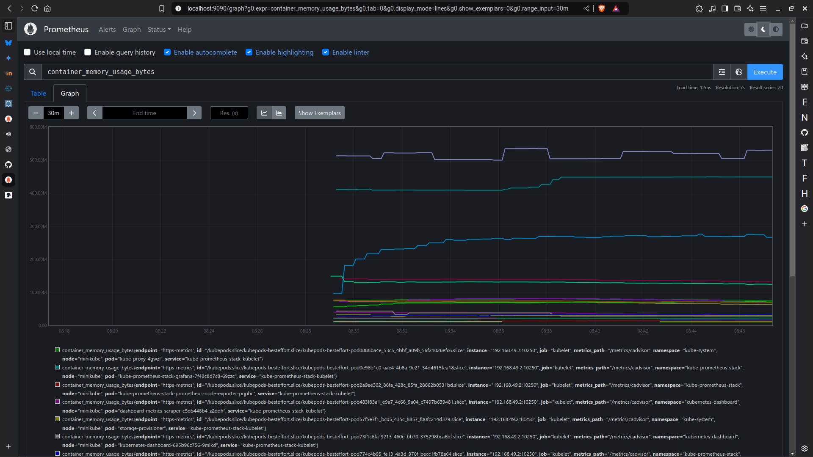

# Assignment - Monitor Kubernetes cluster using Prometheus

## Install Helm on your local machine

```bash
fish # curl -fsSL -o get_helm.sh https://raw.githubusercontent.com/helm/helm/main/scripts/get-helm-3
ish # chmod 700 get_helm.sh
fish # ./get_helm.sh
Downloading https://get.helm.sh/helm-v3.16.3-linux-amd64.tar.gz
Verifying checksum... Done.
Preparing to install helm into /usr/local/bin
[sudo] password for mihirvp:
helm installed into /usr/local/bin/helm
```

## Create a deployment-service file for monitoring

```yaml
apiVersion: apps/v1
kind: Deployment
metadata:
    labels:
        app: nginx-prometheus-cluster
    name: nginx-prometheus-cluster
spec:
    replicas: 2
    selector:
        matchLabels:
            app: nginx-prometheus-cluster
    template:
        metadata:
            labels:
                app: nginx-prometheus-cluster
        spec:
            containers:
                - image: nginx:latest
                  name: nginx
                  resources:
                      limits:
                          cpu: 500m
                          memory: 256Mi

---
apiVersion: v1
kind: Service
metadata:
    name: nginx-prometheus-service
spec:
    selector:
        app: nginx-prometheus-cluster
    ports:
        - port: 8080
          targetPort: 80
```

## Install Prometheus Stack using Helm chart

```bash
fish # helm repo add prometheus-community https://prometheus-community.github.io/helm-charts
"prometheus-community" already exists with the same configuration, skipping
fish # helm repo update
Hang tight while we grab the latest from your chart repositories...
...Successfully got an update from the "prometheus-community" chart repository
fish # helm install kube-prometheus-stack \
           --create-namespace \
           --namespace kube-prometheus-stack \
           prometheus-community/kube-prometheus-stack
NAME: kube-prometheus-stack
LAST DEPLOYED: Wed Nov 20 13:55:32 2024
NAMESPACE: kube-prometheus-stack
STATUS: deployed
REVISION: 1
NOTES:
kube-prometheus-stack has been installed. Check its status by running:
  kubectl --namespace kube-prometheus-stack get pods -l "release=kube-prometheus-stack"

Visit https://github.com/prometheus-operator/kube-prometheus for instructions on how to create & configure Alertmanager and Prometheus instances using the Operator.

```

-   Get running pods on `kube-prometheus-stack` namespace

```bash
fish # kubectl -n kube-prometheus-stack get pods
NAME                                                        READY   STATUS    RESTARTS   AGE
alertmanager-kube-prometheus-stack-alertmanager-0           2/2     Running   0          2m33s
kube-prometheus-stack-grafana-7f48c8d7c8-69zzc              3/3     Running   0          3m16s
kube-prometheus-stack-kube-state-metrics-847c7bf499-x4txs   1/1     Running   0          3m16s
kube-prometheus-stack-operator-76d8665f7f-xjhpg             1/1     Running   0          3m16s
kube-prometheus-stack-prometheus-node-exporter-pqpbc        1/1     Running   0          3m16s
prometheus-kube-prometheus-stack-prometheus-0               2/2     Running   0          2m33s
```

-   now that Prometheus is running, we can access the UI at `http://localhost:9090`, with port forwarding.

```bash
fish # kubectl port-forward -n kube-prometheus-stack svc/kube-prometheus-stack-prometheus 9090:9090
Forwarding from 127.0.0.1:9090 -> 9090
Forwarding from [::1]:9090 -> 9090
Handling connection for 9090
...
```

-   let's deploy our application on the Prometheus cluster

```bash
fish # kubectl -n kube-prometheus-stack apply -f nginx-deployment.yaml
deployment.apps/nginx-prometheus-cluster created
service/nginx-prometheus-service created

fish # kubectl -n kube-prometheus-stack get pods,svc,deployments.apps
NAME                                                            READY   STATUS    RESTARTS   AGE
pod/alertmanager-kube-prometheus-stack-alertmanager-0           2/2     Running   0          23m
pod/kube-prometheus-stack-grafana-7f48c8d7c8-69zzc              3/3     Running   0          24m
pod/kube-prometheus-stack-kube-state-metrics-847c7bf499-x4txs   1/1     Running   0          24m
pod/kube-prometheus-stack-operator-76d8665f7f-xjhpg             1/1     Running   0          24m
pod/kube-prometheus-stack-prometheus-node-exporter-pqpbc        1/1     Running   0          24m
pod/nginx-prometheus-cluster-5b88f7c58b-xjbz6                   1/1     Running   0          7m36s
pod/nginx-prometheus-cluster-5b88f7c58b-xndq8                   1/1     Running   0          7m36s
pod/prometheus-kube-prometheus-stack-prometheus-0               2/2     Running   0          23m

NAME                                                     TYPE        CLUSTER-IP       EXTERNAL-IP   PORT(S)                      AGE
service/alertmanager-operated                            ClusterIP   None             <none>        9093/TCP,9094/TCP,9094/UDP   23m
service/kube-prometheus-stack-alertmanager               ClusterIP   10.104.231.132   <none>        9093/TCP,8080/TCP            24m
service/kube-prometheus-stack-grafana                    ClusterIP   10.105.89.199    <none>        80/TCP                       24m
service/kube-prometheus-stack-kube-state-metrics         ClusterIP   10.106.40.34     <none>        8080/TCP                     24m
service/kube-prometheus-stack-operator                   ClusterIP   10.102.93.9      <none>        443/TCP                      24m
service/kube-prometheus-stack-prometheus                 ClusterIP   10.101.173.37    <none>        9090/TCP,8080/TCP            24m
service/kube-prometheus-stack-prometheus-node-exporter   ClusterIP   10.102.155.21    <none>        9100/TCP                     24m
service/nginx-prometheus-service                         ClusterIP   10.101.143.179   <none>        8080/TCP                     7m36s
service/prometheus-operated                              ClusterIP   None             <none>        9090/TCP                     23m

NAME                                                       READY   UP-TO-DATE   AVAILABLE   AGE
deployment.apps/kube-prometheus-stack-grafana              1/1     1            1           24m
deployment.apps/kube-prometheus-stack-kube-state-metrics   1/1     1            1           24m
deployment.apps/kube-prometheus-stack-operator             1/1     1            1           24m
deployment.apps/nginx-prometheus-cluster                   2/2     2            2           7m36s
```



## Clean up the deployment

```bash
fish # kubectl -n kube-prometheus-stack delete -f ./k8s_prometheus/nginx-deployment.yaml
deployment.apps "nginx-prometheus-cluster" deleted
service "nginx-prometheus-service" deleted
```

-   Remove Prometheus stack configuration

```bash
fish # helm list -A
NAME                    NAMESPACE               REVISION        UPDATED                                 STATUS          CHART                           APP VERSION
kube-prometheus-stack   kube-prometheus-stack   1               2024-11-20 13:55:32.184312826 +0530 IST deployed        kube-prometheus-stack-66.2.1    v0.78.1
fish # helm uninstall kube-prometheus-stack -n kube-prometheus-stack
release "kube-prometheus-stack" uninstalled

```

-   Remove the namespace

```bash
fish # kubectl -n kube-prometheus-stack get all
No resources found in kube-prometheus-stack namespace.
fish # kubectl delete namespaces kube-prometheus-stack
namespace "kube-prometheus-stack" deleted
```
