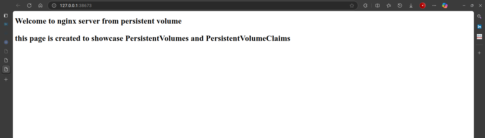

> [Go To home](../kubernetes-labs.md)

# Assignment 6:

## Details: Create a comprehensive assignment to explore different types of volumes in Kubernetes and how they are used to persist data for containerized applications. The assignment should include:

### Persistent Volume (PV) and Persistent Volume Claim (PVC):

-   Write `YAML` files to create a `PersistentVolume` and `PersistentVolumeClaim` with specified storage capacity and access modes.
    Demonstrate how to bind a **PVC** to a **PV** and explain their relationship.

### Using Volumes in a Deployment:

-   Create a Deployment `YAML` file that mounts the PVC as a volume in a container (e.g., a simple Nginx or web server application).
    Specify the volume mount path in the container to ensure data is written to the mounted volume.

### EmptyDir Volume:

-   Include an example in the Deployment YAML that uses an `emptyDir` volume to provide ephemeral storage that persists as long as the pod is running.
    Describe use cases where `emptyDir` volumes are beneficial, such as caching or temporary file storage.

### HostPath Volume:

-   Create an example to show how a `hostPath` volume can be used to access specific directories on the host node.
    Discuss the risks and use cases of using `hostPath`, including security implications.

---

---

## Solution

### 1. `emptyDir` Volume

-   `emptyDir` volume is a temporary directory that is created on the host node and shared among all containers in a pod. It is used to store temporary files or cache data that should not be persisted after the pod is terminated.

-   creating a `Deployment` `yaml` file that uses an `emptyDir` volume to store data in a container. (`nginx` and `busybox` containers)

-   create a _NodePort_ `Service` file to expose the `deployment` volume.

```yaml
apiVersion: apps/v1
kind: Deployment
metadata:
    name: emptydir-demo-app
spec:
    selector:
        matchLabels:
            app: emptydir-demo-app
    template:
        metadata:
            name: emptydir-demo-app
            labels:
                app: emptydir-demo-app
        spec:
            replicas: 1
            containers:
                - name: emptydir-demo-nginx-1
                  image: nginx:latest
                  resources:
                      limits:
                          memory: "256Mi"
                          cpu: "500m"
                  ports:
                      - containerPort: 80
                  volumeMounts:
                      - name: emptydir-volume
                        mountPath: /usr/share/nginx/html
                - name: emptydir-demo-busybox
                  image: busybox:latest
                  command:
                      - sleep
                      - "1000"
                  volumeMounts:
                      - name: emptydir-volume
                        mountPath: /data
                        readOnly: false
                  resources:
                      limits:
                          memory: "256Mi"
                          cpu: "500m"
            volumes:
                - name: emptydir-volume
                  emptyDir: {}

---
apiVersion: v1
kind: Service
metadata:
    name: storage-service
spec:
    type: NodePort
    selector:
        app: emptydir-demo-app
    ports:
        - port: 8080
          targetPort: 80
          nodePort: 31000
```

-   now lets run the yaml file to create the deployment and service.

```bash
fish # kubectl apply -f emptydir-config.yaml
deployment.apps/emptydir-demo-app created
service/storage-service created

fish # kubectl get all
NAME                                     READY   STATUS    RESTARTS   AGE
pod/emptydir-demo-app-5967957d8c-8d65z   2/2     Running   0          83s

NAME                      TYPE        CLUSTER-IP    EXTERNAL-IP   PORT(S)          AGE
service/kubernetes        ClusterIP   10.96.0.1     <none>        443/TCP          8d
service/storage-service   NodePort    10.99.22.44   <none>        8080:31000/TCP   83s

NAME                                READY   UP-TO-DATE   AVAILABLE   AGE
deployment.apps/emptydir-demo-app   1/1     1            1           83s

NAME                                           DESIRED   CURRENT   READY   AGE
replicaset.apps/emptydir-demo-app-5967957d8c   1         1         1       83s
```

-   looks like the deployment is running fine.

next lets check the service if nginx is running on Browser.

```bash
fish # minikube service list
|----------------------|---------------------------|--------------|-----|
|      NAMESPACE       |           NAME            | TARGET PORT  | URL |
|----------------------|---------------------------|--------------|-----|
| default              | kubernetes                | No node port |     |
| default              | storage-service(*)        |         8080 |     |
| kube-system          | kube-dns                  | No node port |     |
| kube-system          | metrics-server            | No node port |     |
| kubernetes-dashboard | dashboard-metrics-scraper | No node port |     |
| kubernetes-dashboard | kubernetes-dashboard      | No node port |     |
|----------------------|---------------------------|--------------|-----|

fish # minikube service storage-service
|-----------|-----------------|-------------|---------------------------|
| NAMESPACE |      NAME       | TARGET PORT |            URL            |
|-----------|-----------------|-------------|---------------------------|
| default   | storage-service |        8080 | http://192.168.49.2:31000 |
|-----------|-----------------|-------------|---------------------------|
🏃  Starting tunnel for service storage-service.
|-----------|-----------------|-------------|------------------------|
| NAMESPACE |      NAME       | TARGET PORT |          URL           |
|-----------|-----------------|-------------|------------------------|
| default   | storage-service |             | http://127.0.0.1:41599 |
|-----------|-----------------|-------------|------------------------|
🎉  Opening service default/storage-service in default browser...
❗  Because you are using a Docker driver on linux, the terminal needs to be open to run it.
Opening in existing browser session.
...

# in another terminal session
fish # curl http://127.0.0.1:41599/
<html>
<head><title>403 Forbidden</title></head>
<body>
<center><h1>403 Forbidden</h1></center>
<hr><center>nginx/1.27.2</center>
</body>
</html>

```

-   Hmm, looks like we are not able to access the service.
-   let's check if HTML file is there in the `emptyDir` volume. we can see the `/data` in the busybox container and the `/usr/share/nginx/html` in the nginx container is attached to the `emptyDir` volume.

```bash
fish # kubectl get pods
NAME                                 READY   STATUS    RESTARTS   AGE
emptydir-demo-app-5967957d8c-8d65z   2/2     Running   0          3m11s

fish # kubectl exec -it emptydir-demo-app-5967957d8c-8d65z -c emptydir-demo-nginx-1 -- ls /usr/share/nginx/html
fish # kubectl exec -it emptydir-demo-app-5967957d8c-8d65z -c emptydir-demo-busybox -- ls /data

```

-   As we can see the data is not there in the `emptyDir` volume.
-   Let's add data to the `emptyDir` volume with busybox container.

```bash
fish # kubectl exec -it emptydir-demo-app-5967957d8c-8d65z -c emptydir-demo-busybox -- /bin/sh
/ # ls
bin    data   dev    etc    home   lib    lib64  proc   root   sys    tmp    usr    var

/ # cd /data
/data # ls
/data # cat index.html
/data # echo "<!doctype HTML> \
> <html> \
> <h1> hello from Busybox in Nginx <h1> \
> </html>
> \" > index.html
/data # cat index.html
<!doctype HTML> <html> <h1> hello from Busybox in Nginx <h1> </html>
/data # exit
...
fish # kubectl exec -it emptydir-demo-app-5967957d8c-8d65z -c emptydir-demo-busybox -- cat /data/index.html
<!doctype HTML> <html> <h1> hello from Busybox in Nginx <h1> </html>
```

-   now lets check if nginx picks up the file.

```bash
fish # minikube service list
|----------------------|---------------------------|--------------|-----|
|      NAMESPACE       |           NAME            | TARGET PORT  | URL |
|----------------------|---------------------------|--------------|-----|
| default              | kubernetes                | No node port |     |
| default              | storage-service(*)        |         8080 |     |
| kube-system          | kube-dns                  | No node port |     |
| kube-system          | metrics-server            | No node port |     |
| kubernetes-dashboard | dashboard-metrics-scraper | No node port |     |
| kubernetes-dashboard | kubernetes-dashboard      | No node port |     |
|----------------------|---------------------------|--------------|-----|
fish # minikube service storage-service
|-----------|-----------------|-------------|---------------------------|
| NAMESPACE |      NAME       | TARGET PORT |            URL            |
|-----------|-----------------|-------------|---------------------------|
| default   | storage-service |        8080 | http://192.168.49.2:31000 |
|-----------|-----------------|-------------|---------------------------|
🏃  Starting tunnel for service storage-service.
|-----------|-----------------|-------------|------------------------|
| NAMESPACE |      NAME       | TARGET PORT |          URL           |
|-----------|-----------------|-------------|------------------------|
| default   | storage-service |             | http://127.0.0.1:41199 |
|-----------|-----------------|-------------|------------------------|
🎉  Opening service default/storage-service in default browser...
❗  Because you are using a Docker driver on linux, the terminal needs to be open to run it.
Opening in existing browser session.

...
```


-   ..and it works! as you can see the file is there in the `nginx` since data is persisted in the `emptyDir` volume.

#### `EmptyDir` Use cases

1. **Log Aggregation and Processing**: Temporary storage for logs that are aggregated and processed by containers within the same pod.

2. **In-Memory Data Processing**: Using emptyDir.medium: Memory to mount a tmpfs (RAM-backed filesystem) for faster performance.

3. **Batch Job Processing**: Storing intermediate data during batch processing jobs.

4. **Scratch Space**: Temporary storage for disk-based merge sorts or other scratch space needs.

5. **Checkpointing**: Saving checkpoints during long computations to recover from crashes.

6. **Content Management**: Holding files that a content-manager container fetches while a webserver container serves the data.

### 2. Persistent Volumes and Persistent Volume Claims

-   Persistent Volumes (PV) are a storage resource provisioned by an administrator. They are similar to a physical disk in a computer. PVs are used to store data that needs to persist beyond the lifetime of a pod.
    -   This is a storage resource that is abstractly presented to the Kubernetes cluster as a `PersistentVolume` resource.
    -   This can be backed by various storage systems like Cloud Storage, NFS, local storage, etc.
-   Persistent Volume Claims (PVC) are a request for storage by a pod.
    -   this is referenced to a `PersistentVolume` resource, and specifies the amount of storage to be allocated and access modes.

> Let's create a `PersistentVolume` and `PersistentVolumeClaim` for the `nginx` pod.

```yaml
apiVersion: v1
kind: PersistentVolume
metadata:
    name: my-pv-volume
    labels:
        type: local
spec:
    capacity:
        storage: 2Gi
    volumeMode: Filesystem
    accessModes:
        - ReadWriteOnce
    storageClassName: local-storage
    hostPath:
        path: "/tmp/data"
```

> Here we are setting up `HostPath` as the storage type. `HostPath` is the directory on the node that will be created on the host and used as storage mount to the pod.

> Also mentioned that the `storageClassName` is `local-storage` which is right now just a placeholder, that acts as a label for the `PersistentVolume` and `PersistentVolumeClaim` to be created.

-   now, lets create this persistent volume, and check if it is created successfully.

```bash
fish # kubectl apply -f persvol-config.yaml
persistentvolume/my-pv-volume created
fish # kubectl get pv
NAME           CAPACITY   ACCESS MODES   RECLAIM POLICY   STATUS      CLAIM   STORAGECLASS    VOLUMEATTRIBUTESCLASS   REASON   AGE
my-pv-volume   2Gi        RWO            Retain           Available           local-storage   <unset>                          6s
```

> `PersistentVolumeClaim` (or PVCs) allows pods to connect any type of storage that is provided at a specific site.
> Site specific storage needs to be created as a `PersistentVolume`, either manually or with `StorageClass`.
> A Storage Provider/ Storage Provisioner is required to create a `PersistentVolume` with `StorageClass`.

-   let's create a `PersistentVolumeClaim` and check how this works.

```yaml
apiVersion: v1
kind: PersistentVolumeClaim
metadata:
    name: pv-claim
spec:
    resources:
        requests:
            storage: 1Gi
    volumeMode: Filesystem
    accessModes:
        - ReadWriteOnce
```

```bash
fish # kubectl apply -f pvc-config.yaml
persistentvolumeclaim/pv-claim created
fish # kubectl get pv,pvc
NAME                                                        CAPACITY   ACCESS MODES   RECLAIM POLICY   STATUS      CLAIM              STORAGECLASS    VOLUMEATTRIBUTESCLASS   REASON   AGE
persistentvolume/my-pv-volume                               2Gi        RWO            Retain           Available                      local-storage   <unset>                          13m
persistentvolume/pvc-1bfca167-868a-4868-a6fd-bdea9440d169   1Gi        RWO            Delete           Bound       default/pv-claim   standard        <unset>                          9s

NAME                             STATUS   VOLUME                                     CAPACITY   ACCESS MODES   STORAGECLASS   VOLUMEATTRIBUTESCLASS   AGE
persistentvolumeclaim/pv-claim   Bound    pvc-1bfca167-868a-4868-a6fd-bdea9440d169   1Gi        RWO            standard       <unset>                 9s
```

-   Here, as we have not mentioned `StorageClassProvider` in `PersistentVolumeClaim` configuration, we can see a default `PersistentVolume` created by **minikube** configuration to fulfill needs for our claim.

-   To attach / request claim from our original _PersistentVolume_ Configuration, we will add `StorageClassName` to our `PersistentVolumeClaim` configuration.

##### _edited `yaml`_

```yaml
apiVersion: v1
kind: PersistentVolumeClaim
metadata:
    name: pv-claim
spec:
    storageClassName: local-storage # added StorageClassName to match with PersistentVolume configuration
    resources:
        requests:
            storage: 1Gi
    volumeMode: Filesystem
    accessModes:
        - ReadWriteOnce
```

now, let's delete old persistent volume claim and create new one with `StorageClassName` added.

```bash
fish # kubectl delete -f pvc-config.yaml
persistentvolumeclaim "pv-claim" deleted
fish # kubectl get pv,pvc
NAME                            CAPACITY   ACCESS MODES   RECLAIM POLICY   STATUS      CLAIM   STORAGECLASS    VOLUMEATTRIBUTESCLASS   REASON   AGE
persistentvolume/my-pv-volume   2Gi        RWO            Retain           Available           local-storage   <unset>                          26m
fish # kubectl apply -f pvc-config.yaml
persistentvolumeclaim/pv-claim created
fish # kubectl get pv,pvc
NAME                            CAPACITY   ACCESS MODES   RECLAIM POLICY   STATUS   CLAIM              STORAGECLASS    VOLUMEATTRIBUTESCLASS   REASON   AGE
persistentvolume/my-pv-volume   2Gi        RWO            Retain           Bound    default/pv-claim   local-storage   <unset>                          24s

NAME                             STATUS   VOLUME         CAPACITY   ACCESS MODES   STORAGECLASS    VOLUMEATTRIBUTESCLASS   AGE
persistentvolumeclaim/pv-claim   Bound    my-pv-volume   2Gi        RWO            local-storage   <unset>                 2s
```

-   as we can see, now we have a `PersistentVolume` with `StorageClass` set to `local-storage` and `PersistentVolumeClaim` is bound to it.

> Note, despite being claim of 1Gi, our PVC has a `storage` of 2Gi. This is because you cannot claim partial space from a `PersistentVolume`, if there are no other claims, `PersistentVolumeClaim` will bind to all the available space with PV.

-   let's create a deployment to test our persistent volume claim.

```yaml
apiVersion: apps/v1
kind: Deployment
metadata:
    labels:
        app: pvc-nginx
    name: pvc-nginx
spec:
    replicas: 2
    selector:
        matchLabels:
            app: pvc-nginx
    template:
        metadata:
            labels:
                app: pvc-nginx
        spec:
            containers:
                - image: nginx:latest
                  name: nginx
                  resources:
                      limits:
                          memory: "256Mi"
                          cpu: "500m"
                  ports:
                      - containerPort: 80
                  volumeMounts:
                      - name: pv-storage
                        mountPath: /usr/share/nginx/html
            volumes:
                - name: pv-storage
                  persistentVolumeClaim:
                      claimName: pv-claim
```

-   let's run this deployment and see if persistentvolumeclaim is bound to our persistent volume.

```bash
fish # kubectl get all
NAME                                     READY   STATUS    RESTARTS       AGE
pod/emptydir-demo-app-5967957d8c-8d65z   2/2     Running   20 (12m ago)   5h47m
pod/pvc-nginx-7d9d8f578f-45qdq           1/1     Running   0              7s
pod/pvc-nginx-7d9d8f578f-6rlnp           1/1     Running   0              7s

NAME                      TYPE        CLUSTER-IP    EXTERNAL-IP   PORT(S)          AGE
service/kubernetes        ClusterIP   10.96.0.1     <none>        443/TCP          8d
service/storage-service   NodePort    10.99.22.44   <none>        8080:31000/TCP   5h47m

NAME                                READY   UP-TO-DATE   AVAILABLE   AGE
deployment.apps/emptydir-demo-app   1/1     1            1           5h47m
deployment.apps/pvc-nginx           2/2     2            2           7s

NAME                                           DESIRED   CURRENT   READY   AGE
replicaset.apps/emptydir-demo-app-5967957d8c   1         1         1       5h47m
replicaset.apps/pvc-nginx-7d9d8f578f           2         2         2       7s
fish # kubectl get pv,pvc
NAME                            CAPACITY   ACCESS MODES   RECLAIM POLICY   STATUS   CLAIM              STORAGECLASS    VOLUMEATTRIBUTESCLASS   REASON   AGE
persistentvolume/my-pv-volume   2Gi        RWO            Retain           Bound    default/pv-claim   local-storage   <unset>                          11m

NAME                             STATUS   VOLUME         CAPACITY   ACCESS MODES   STORAGECLASS    VOLUMEATTRIBUTESCLASS   AGE
persistentvolumeclaim/pv-claim   Bound    my-pv-volume   2Gi        RWO            local-storage   <unset>                 11m
```

-   configuration for `PersistentVolume` and `PersistentVolumeClaim` is done. now let's check in cluster if pod volume is mounted to the host path.

```bash
fish # kubectl exec -it pvc-nginx-7cd869b8dc-g5dd4 -- ls /usr/share/nginx/html
fish # minikube ssh
docker@minikube:~$ ls /tmp/data/
docker@minikube:~$ ls /data/
docker@minikube:~$
```

-   Looks like the data is not there in the `hostPath` mounted to the pod.
-   let's add data to the `hostPath` mounted to the pod.

```bash
docker@minikube:~$ cd /tmp/data/
docker@minikube:/tmp/data$ sudo vi index.html
docker@minikube:/tmp/data$ cat index.html
<!Doctype html>
<html>
    <head>
        <title> Nginx server </title>
    </head>
    <body>
        <h1> Welcome to nginx server from persistent volume </h1>
        <p> this page is created to showcase PersistentVolumes and PersistentVolumeClaims </p>
    </body>
</html>
docker@minikube:/tmp/data$ exit
```

-   now, let's check if containers give any response.

```bash
fish # kubectl exec -it pvc-nginx-7cd869b8dc-g5dd4 -- ls /usr/share/nginx/html
index.html
fish # kubectl exec -it pvc-nginx-7cd869b8dc-g5dd4 -- curl localhost
<!Doctype html>
<html>
    <head>
        <title> Nginx server </title>
    </head>
    <body>
        <h1> Welcome to nginx server from pwersistent volume <h1>
        <p> this page is created to showcase PersistentVolumes and PersistentVolumeClaims </p>
    </body>
</html>
```

-   ...and it is added! as you can see the file is there in the `pvc-pod-....` since data is persisted in the `hostPath` mounted to the pod.

-   let's see this on the browser by creating a service for the `pvc-nginx` deployment.

```yaml
apiVersion: v1
kind: Service
metadata:
    name: pv-service
spec:
    selector:
        app: pvc-nginx
    type: NodePort
    ports:
        - port: 8080
          targetPort: 80
          nodePort: 32000
```

-   let's apply this service and check if it is working.

```bash
fish # kubectl apply -f pv-service.yaml
service/pv-service created
fish # kubectl get svc
NAME              TYPE        CLUSTER-IP      EXTERNAL-IP   PORT(S)          AGE
kubernetes        ClusterIP   10.96.0.1       <none>        443/TCP          8d
pv-service        NodePort    10.107.37.221   <none>        8080:32000/TCP   15s
storage-service   NodePort    10.99.22.44     <none>        8080:31000/TCP   6h17m
```

-   service is successfully created. now let's check if the service is working on the browser.

```bash
fish # minikube service list
|----------------------|---------------------------|--------------|-----|
|      NAMESPACE       |           NAME            | TARGET PORT  | URL |
|----------------------|---------------------------|--------------|-----|
| default              | kubernetes                | No node port |     |
| default              | pv-service(*)             |         8080 |     |
| default              | storage-service           |         8080 |     |
| kube-system          | kube-dns                  | No node port |     |
| kube-system          | metrics-server            | No node port |     |
| kubernetes-dashboard | dashboard-metrics-scraper | No node port |     |
| kubernetes-dashboard | kubernetes-dashboard      | No node port |     |
|----------------------|---------------------------|--------------|-----|
fish # minikube service pv-service
|-----------|------------|-------------|---------------------------|
| NAMESPACE |    NAME    | TARGET PORT |            URL            |
|-----------|------------|-------------|---------------------------|
| default   | pv-service |        8080 | http://192.168.49.2:32000 |
|-----------|------------|-------------|---------------------------|
🏃  Starting tunnel for service pv-service.
|-----------|------------|-------------|------------------------|
| NAMESPACE |    NAME    | TARGET PORT |          URL           |
|-----------|------------|-------------|------------------------|
| default   | pv-service |             | http://127.0.0.1:38673 |
|-----------|------------|-------------|------------------------|
🎉  Opening service default/pv-service in default browser...
❗  Because you are using a Docker driver on linux, the terminal needs to be open to run it.
Opening in existing browser session.
...
```



-   ...and it works! as you can see we have successfully created a `PersistentVolume` and `PersistentVolumeClaim` and mounted the `hostPath` to the `pvc-nginx` pod.
-   we successfully created service for the `pvc-nginx` deployment and exposed it on the browser.

-   to test it further, let's delete the pods and check if data is still there.

```bash
fish # kubectl delete pods pvc-nginx-7cd869b8dc-99zlb pvc-nginx-7cd869b8dc-g5dd4
pod "pvc-nginx-7cd869b8dc-99zlb" deleted
pod "pvc-nginx-7cd869b8dc-g5dd4" deleted
fish # kubectl get pods -o wide
NAME                                 READY   STATUS    RESTARTS        AGE     IP             NODE       NOMINATED NODE   READINESS GATES
emptydir-demo-app-5967957d8c-8d65z   2/2     Running   23 (3m8s ago)   6h28m   10.244.0.202   minikube   <none>           <none>
pvc-nginx-7cd869b8dc-c8fbj           1/1     Running   0               12s     10.244.0.208   minikube   <none>           <none>
pvc-nginx-7cd869b8dc-d2n9x           1/1     Running   0               12s     10.244.0.207   minikube   <none>           <none>
```

-   new pods are running. let's see if service is running.

```bash
fish # kubectl exec -it pvc-nginx-7cd869b8dc-c8fbj -- curl localhost
<!Doctype html>
<html>
    <head>
        <title> Nginx server </title>
    </head>
    <body>
        <h1> Welcome to nginx server from persistent volume <h1>
        <p> this page is created to showcase PersistentVolumes and PersistentVolumeClaims </p>
    </body>
</html>
```

-   still working! thus data is successfully persisted in the `hostPath` mounted to the pod, with the help of `PersistentVolume` and `PersistentVolumeClaim`.

### 3. Use Cases and Risks of `hostPath`

1. Use Cases:

-   **Debugging and Testing**:

    -   For debugging purposes, you can mount a local directory to inspect logs, configuration files, or other artifacts.
        For testing, you can use HostPath volumes to mount test data or configuration files.

-   **Specific Hardware Access**:

    -   If your application requires direct access to specific hardware devices, such as GPUs or network interfaces, HostPath volumes can be used to mount the device's device node.

2. **Risks and Security Implications**:

-   **Portability**:

    -   Using HostPath volumes can reduce the portability of your application, as it ties the pod to a specific node. This can make it difficult to migrate or scale your application.

-   **Security Risks**:

    -   **Data Exposure**: If the host directory contains sensitive data exposing it to the pod can increase the risk of data breaches.
    -   **Privilege Escalation**: Malicious actors could potentially exploit vulnerabilities in the pod to gain access to the host system.
    -   **Configuration Drift**: If the host directory is modified outside of Kubernetes, it can lead to unexpected behavior or errors in the pod.

### 4. Cleaning Up

-   To clean up the resources, you can delete all the resources created in this assignment.

```bash
fish # kubectl delete -f pv-service.yaml
service "pv-service" deleted
fish # kubectl delete -f pvc-deployment.yaml
deployment.apps "pvc-nginx" deleted
fish # kubectl delete -f persvol-config.yaml
persistentvolume "my-pv-volume" deleted
fish # kubectl delete -f emptydir-config.yaml
deployment.apps "emptydir-demo-app" deleted
service "storage-service" deleted
fish # kubectl delete -f pvc-config.yaml
persistentvolumeclaim "pv-claim" deleted

fish # kubectl get all
NAME                 TYPE        CLUSTER-IP   EXTERNAL-IP   PORT(S)   AGE
service/kubernetes   ClusterIP   10.96.0.1    <none>        443/TCP   8d
fish # kubectl get pv,pvc
No resources found
```
