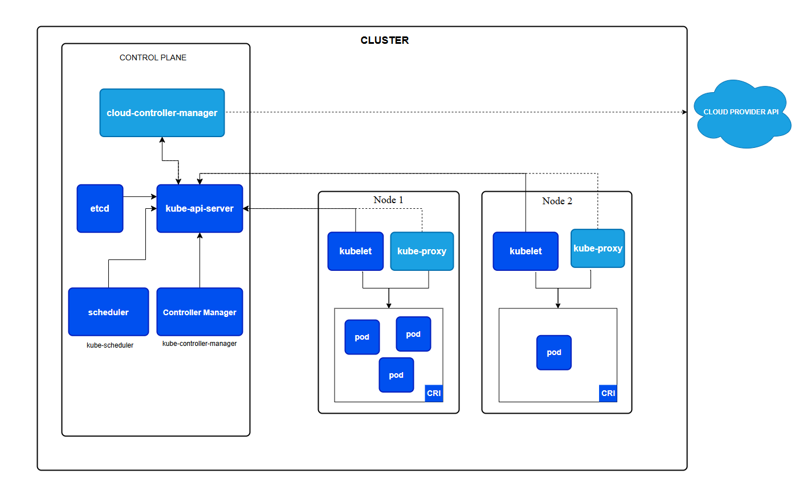

> [Go to Home](../kubernetes-labs.md)

# Assignment No 2:

## Title: Kubernetes Architecture

### Part 1: Kubernetes Architecture

Kubernetes is designed as a distributed system composed of multiple components that work together to manage containerized applications. Here's an overview of the key components:

#### 1.1. Master Components (Control Plane)

The control plane manages the Kubernetes cluster, handling scheduling, maintaining cluster state, and managing the lifecycle of applications.

**1. API Server (kube-apiserver):**

-   **Role:** The API server is the central management entity that exposes the Kubernetes API. All interactions with the cluster—whether from `kubectl`, other components, or external systems—go through the API server.
-   **Function:** Validates and configures the data for API objects, including pods, services, and controllers. It serves as the frontend for the Kubernetes control plane.

**2. Etcd:**

-   **Role:** Etcd is a distributed key-value store used by Kubernetes to store all cluster data.
-   **Function:** It stores the configuration data, cluster state, and metadata that need to be persisted across restarts and network partitions.

**3. Controller Manager (`kube-controller-manager`):**

-   **Role:** Runs various controllers that manage the state of the cluster.
-   **Function:** Ensures the desired state of the cluster matches the current state. Examples include the replication controller, node controller, and endpoint controller.

**4. Scheduler (`kube-scheduler`):**

-   **Role:** Responsible for assigning work to the nodes in the cluster.
-   **Function:** It watches for newly created pods that do not have a node assigned yet and selects a node for them to run on based on resource requirements, policies, and constraints.

#### 1.2. Node Components

Nodes are the worker machines where application workloads run. They can be either virtual or physical machines.

1. **Kubelet:**

-   **Role:** The node agent that runs on every node.
-   **Function:** Ensures that containers are running as specified in the PodSpecs, communicates with the API server, and handles tasks like logging and monitoring.

2. **Kube-proxy:**

-   **Role:** Maintains network rules on nodes.
-   **Function:** Ensures that networking and load balancing between pods across nodes are correctly configured. It forwards traffic destined for a pod’s IP address to the appropriate pod.

3. **Container Runtime:**

-   **Role:** Software responsible for running the containers.
-   **Function:** Kubernetes supports various container runtimes, like Docker, containerd, and CRI-O, which are responsible for pulling container images, starting containers, and managing their lifecycle.

#### 1.3. Kubernetes Objects

Kubernetes uses several types of objects to represent the state of your cluster:

1. **Pod:** The smallest, most basic deployable object. It represents a single instance of a running process in your cluster.

2. **Service:** An abstract way to expose an application running on a set of Pods as a network service.

3. **Deployment:** Manages stateless applications by ensuring that a specified number of pod replicas are running.

4. **ConfigMap and Secret:** Used to manage configuration data and sensitive information (like passwords), respectively.

5. **PersistentVolume and PersistentVolumeClaim:** Manage storage resources in the cluster.
